# 数智人事 (HRM System)

> 基于 Spring Boot 3.4 与 Vue 2.6 构建的现代化全栈人力资源管理系统，深度集成 Flowable 工作流引擎、企业知识库（RAG）与智能问答。

---

## 📖 项目介绍

**数智人事** 是一套面向现代企业的高效人力资源全流程管理系统，旨在提升组织人效与员工自主服务体验。系统采用前后端分离架构，融合企业业务管理规范与先进的生成式 AI 技术：

- **传统业务闭环**：覆盖组织架构、员工全生命周期档案、菜单与角色细粒度 RBAC 权限体系、Flowable 审批流转、灵活考勤与打卡统计、精细化加班与多维假期管理、薪资核算与五险一金配置。
- **智能化升级**：提供基于 RAG（检索增强生成）的企业知识库智能问答，具备员工上下文感知，覆盖政策制度等人事咨询场景。

---

## ✨ 核心亮点

- **业务流程深度解耦与纯计算领域设计**：
  - 考勤核算、加班计算（`OvertimeCalculator`）、审批副作用处理（`LeaveApprovalSideEffects`）以及薪资核算（`SalaryCalculation`）全面收敛为无框架依赖的纯函数领域模型，具备极高的单测覆盖与维护确定性。
- **Flowable 8.0 流程引擎原生适配**：
  - 深度整合 Spring Boot 3.4 与 Flowable 引擎，基于双 MySQL 独立数据源设计（业务主库 + 流程引擎专库），保证核心工作流数据自治与平滑伸缩。
- **双 Token 自动无感续期机制**：
  - 基于 httpOnly Cookie 的双 Token（Access Token + Refresh Token）鉴权体系，前端拦截器透明处理并发无感刷新，阻断 XSS 与 Token 劫持风险。
- **混合持久化与企业级 RAG 知识检索**：
  - 采用 MySQL（业务）+ Redis（缓存/验证码）+ PostgreSQL/pgvector（向量数据库）+ MinIO（对象存储）的多引擎存储架构；内置文档切块、向量化 ETL 流水线，助力企业政策与制度的高精度语义召回。
- **企业知识库与智能问答**：
  - 搭载兼容 DashScope / OpenAI 规范的智能问答服务，基于企业知识库语义检索与员工静态上下文注入（部门、岗位等档案信息），实现政策制度的"即问即答"。

---

## 🖼️ 页面展示

系统各主要功能模块页面效果如下：

### 1. 登录认证与首页仪表盘
| 登录界面 | 首页仪表盘（工作台与考勤日历） |
| :---: | :---: |
| 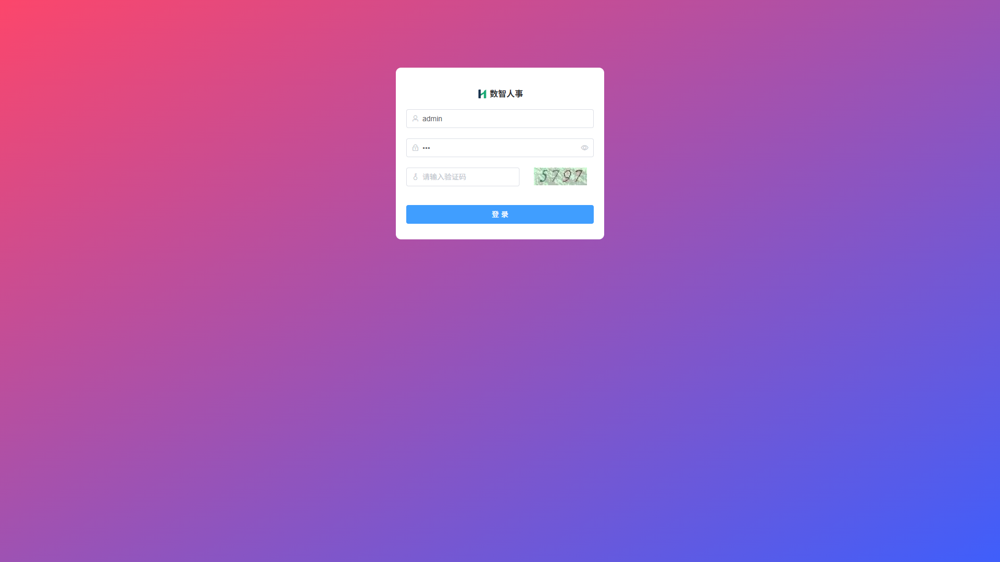 | 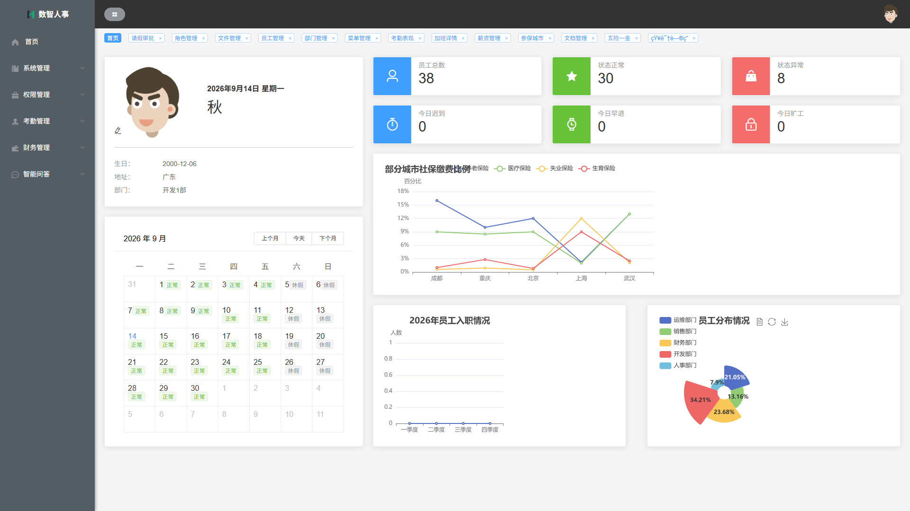 |

### 2. 系统管理
| 员工管理 | 部门管理 |
| :---: | :---: |
| 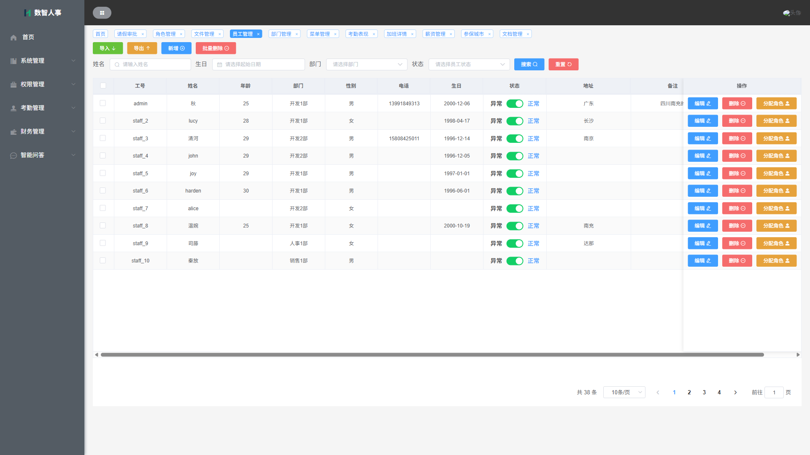 | 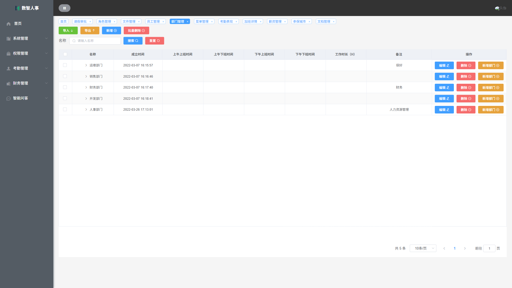 |
| **文件管理** | |
| 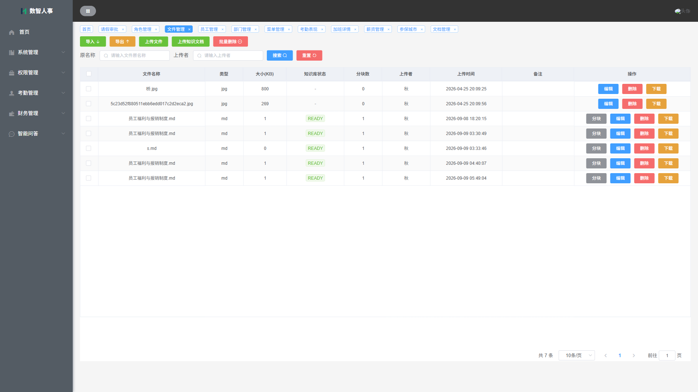 | |

### 3. 权限管理
| 角色权限分配 | 菜单权限配置 |
| :---: | :---: |
| 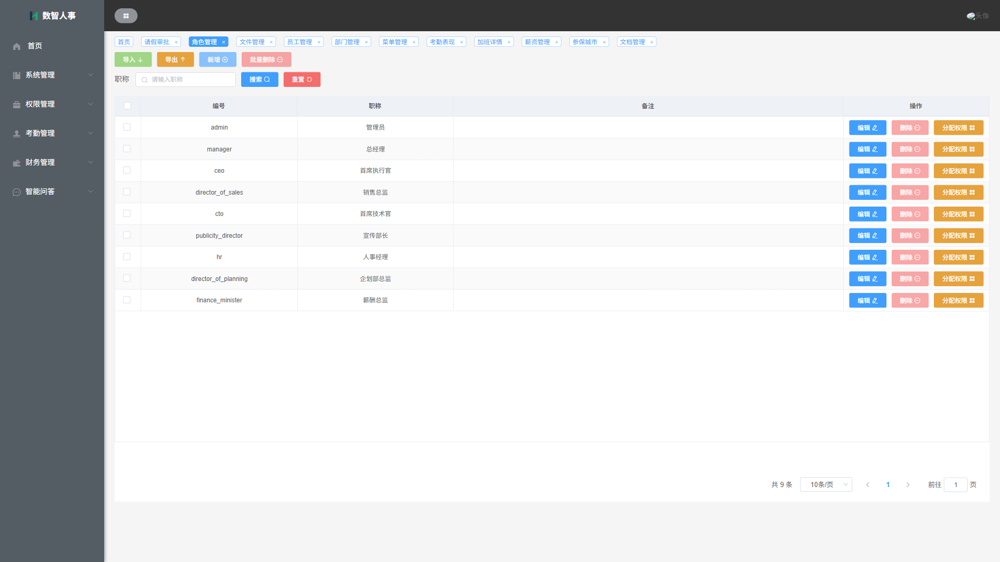 | 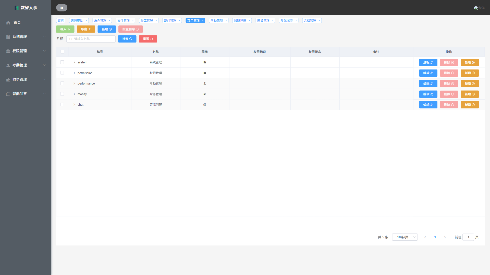 |

### 4. 考勤与审批管理
| 请假申请与审批 | 考勤表现分析 |
| :---: | :---: |
| 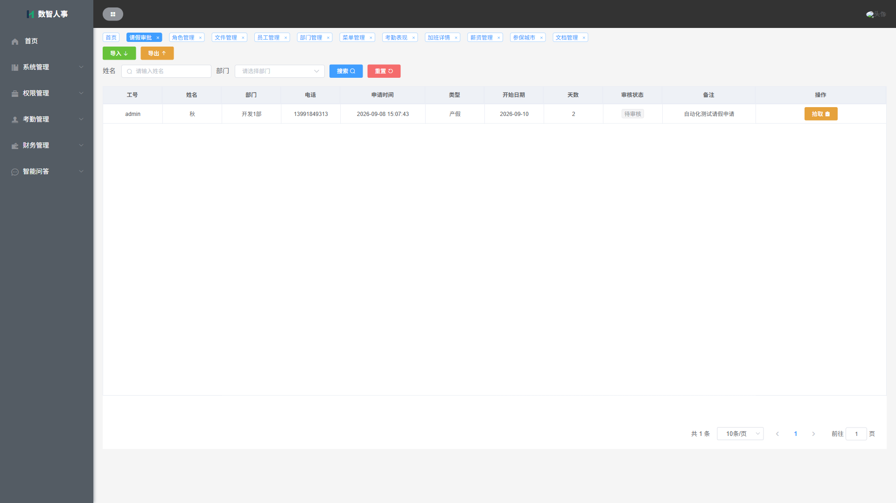 |  |
| **加班详情核算** | |
| 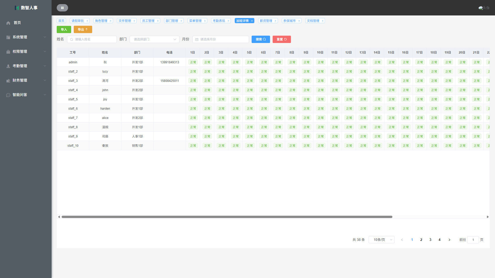 | |

### 5. 财务与社保管理
| 员工薪资管理 | 参保城市与五险一金比例 |
| :---: | :---: |
| 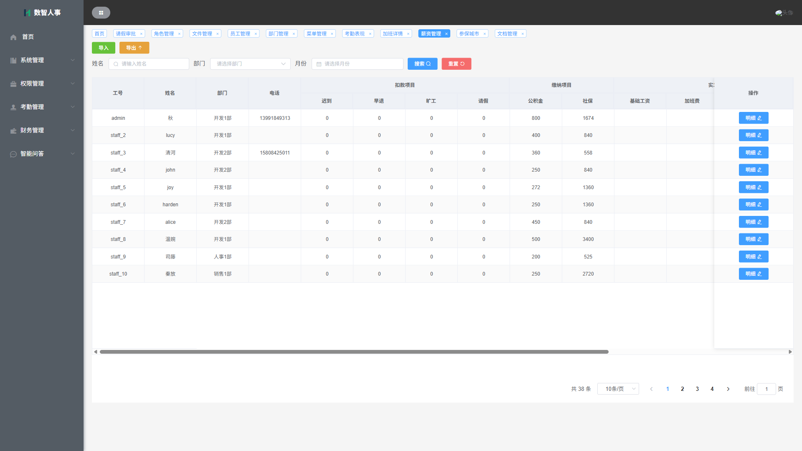 | 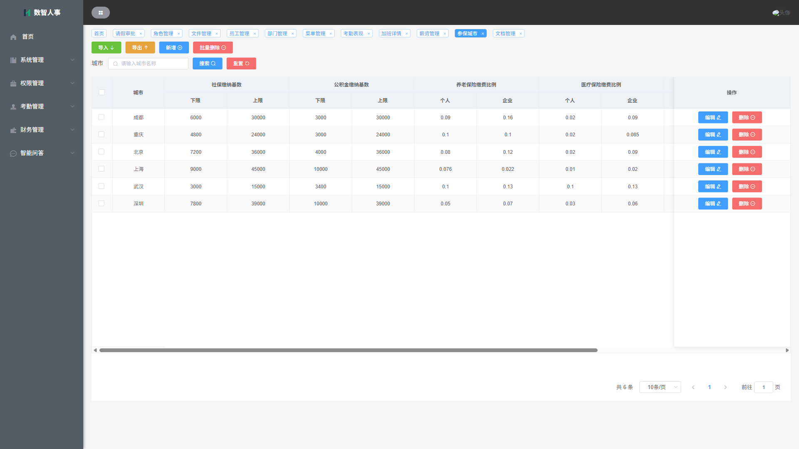 |

### 6. 智能问答
| 智能问答（会话与流式回答） |
| :---: |
| 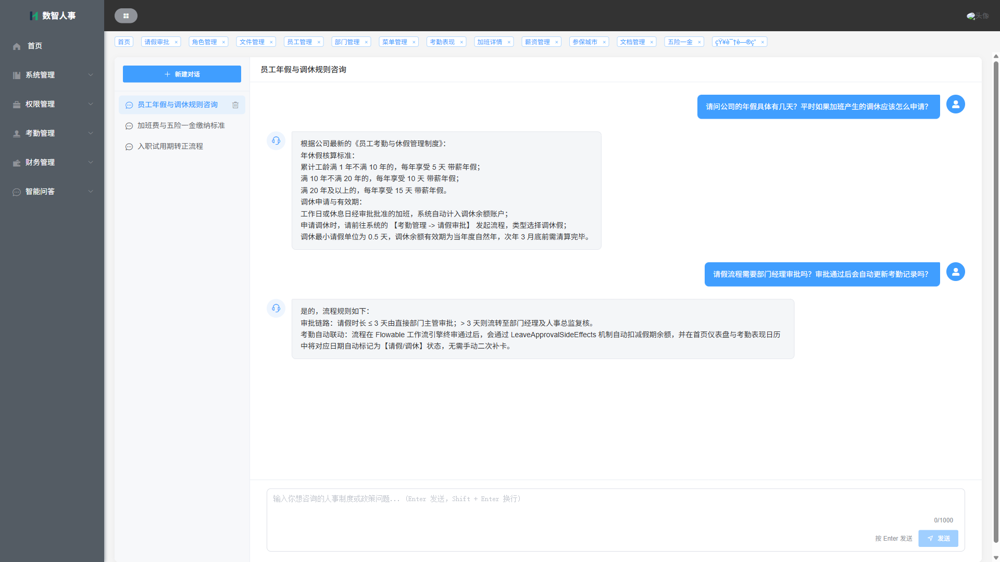 |

---

## 🔄 核心业务流程图

系统关键核心业务（请假/加班审批流转链路 + 企业知识库智能问答闭环）如下所示：

```mermaid
flowchart TD
    subgraph ApprovalFlow["1. 请假与加班审批流转链路"]
        A1[员工端发起申请] --> A2{是否满足申请校验}
        A2 -- 余额/天数合法 --> A3[写入业务申请表并启动 Flowable 流程]
        A2 -- 校验不通过 --> A1
        A3 --> A4[主管/审批人接收任务]
        A4 --> A5{审批决策}
        A5 -- 驳回 --> A6[更新业务单据状态为 REJECT]
        A5 -- 批准 --> A7[触发 LeaveApprovalSideEffects 副作用链]
        A7 --> A8[扣减员工请假天数 / 增加调休时长]
        A8 --> A9[写入考勤状态记录与站内通知]
    end

    subgraph RagFlow["2. 企业知识库与智能问答链路"]
        B1[管理员上传制度文档] --> B2[MinIO 原始文件存储]
        B2 --> B3[ETL 管道: 文档解析与切块]
        B3 --> B4[DashScope Embedding 向量化]
        B4 --> B5[(PostgreSQL pgvector 向量库)]
        
        C1[员工发送人事咨询问题] --> C2[智能问答意图识别]
        C2 --> C4[语义向量相似度检索]
        C4 --> B5
        B5 --> C5[召回相关文档切块上下文]
        C5 --> C6[组合检索上下文与员工档案 Prompt]
        C6 --> C7[大模型生成回答（由 CHAT_PROVIDER_MODEL 配置）]
        C7 --> C8[流式/同步反馈给员工前端]
    end
```

---

## 🛠️ 技术栈

### 后端核心架构

| 技术组件 | 版本 | 用途与说明 |
| :--- | :--- | :--- |
| **Java** | 17 | 开发语言运行环境 |
| **Spring Boot** | 3.4.4 | 现代化微服务脚手架与依赖管理 |
| **MyBatis-Plus** | 3.5.10 | ORM 增强框架，支持多数据源隔离与灵活查询 |
| **Flowable** | 8.0.0 | 原生支持 Spring Boot 3 的企业级工作流引擎 |
| **Spring AI** | 1.0.0 (spring-ai-alibaba 1.0.0.2) | 大模型抽象层，驱动 LLM 对话与 Embedding 交互 |
| **Spring Security** | 6.x | 细粒度 RBAC 安全认证与授权控制 |
| **JJWT** | 0.11.5 | 无状态的双 Token 签名、加解密与有效期校验 |
| **SpringDoc OpenAPI** | 2.8.10 | 遵循 OpenAPI 3.1 规范的接口交互文档（Swagger-UI） |
| **MySQL** | 8.1 | 主业务数据库（`hrm`）与流程引擎专库（`hrm_flowable`） |
| **PostgreSQL** | 16 (pgvector) | 知识库文档分块与高维向量存储数据库（`hrm_kb`） |
| **Redis** | 5.0 | 分布式会话缓存、图形验证码验证与热点数据加速 |
| **MinIO** | Latest | S3 兼容的高性能私有化对象存储服务 |

### 前端技术栈

| 技术组件 | 版本 | 用途与说明 |
| :--- | :--- | :--- |
| **Vue.js** | 2.6.14 | 核心渐进式前端渲染框架 |
| **Element UI** | 2.15.7 | 经典桌面端企业级 UI 组件库 |
| **Vue Router** | 3.2.0 | 前端路由管理，支持基于后端动态菜单的路由载入 |
| **Vuex** | 3.6.2 | 全局集中式状态管理（用户信息、权限点列表等） |
| **Axios** | 0.25.0 | 网络请求库，封装响应拦截器以支持 401 自动无感静默刷新 |
| **ECharts** | 5.3.0 | 首页仪表盘考勤分布与可视化图表分析 |

---

## 🏗️ 系统架构图

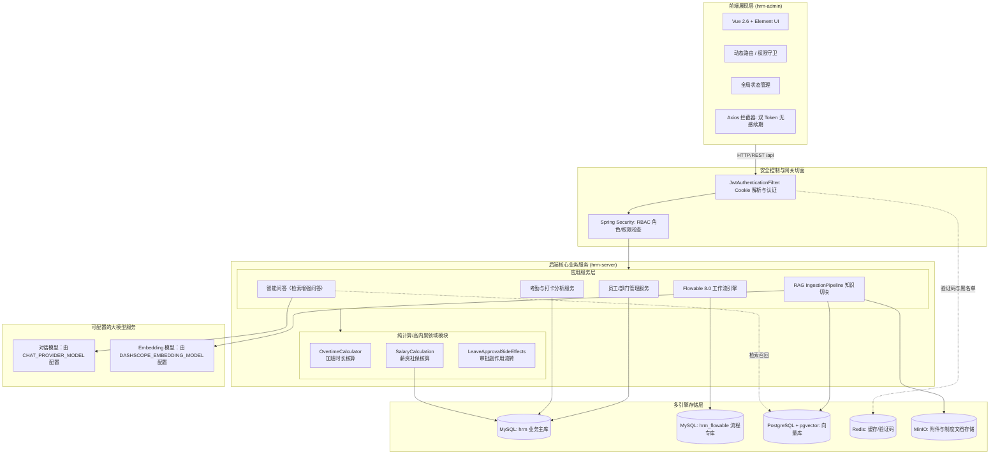

---

## 📂 项目目录结构

```text
hrm/
├── docker-compose.yml              # 本地中间件一键启动编排
├── sql/                            # 数据库初始化脚本
│   └── schema/
│       ├── mysql/
│       │   ├── hrm.sql             # 业务主库表结构与系统种子数据
│       │   └── hrm_flowable.sql    # Flowable 流程引擎专库表结构
│       └── postgresql/
│           └── knowledge_base.sql  # PostgreSQL + pgvector 知识库模式
├── docs/                           # 项目开发规格、测试报告及页面截图
│   └── screenshots/                # README 引用之核心页面截图
├── hrm-admin/                      # 前端工程 (Vue 2.6 + Element UI)
│   ├── public/                     # 页面模板与图标资源
│   └── src/
│       ├── api/                    # 资源粒度划分的后端接口模块
│       ├── assets/                 # 静态样式与全局图标
│       ├── components/             # 通用业务组件 (头部头像/通知等)
│       ├── router/                 # 路由定义与权限动态加载
│       ├── store/                  # Vuex 模块 (staff, menu, token, permission)
│       ├── utils/                  # 请求封装、无感刷新、验证码与头像加载工具
│       └── views/                  # 业务功能页面
│           ├── home/               # 首页仪表盘与打卡日历
│           ├── system/             # 员工、部门、文件存储管理
│           ├── permission/         # 角色与菜单权限管理
│           ├── performance/        # 考勤打卡、加班明细、请假审批
│           ├── money/              # 薪资明细、五险一金比例与参保城市
│           └── chat/               # 智能问答页面
└── hrm-server/                     # 后端工程 (Spring Boot 3.4 + Java 17)
    ├── src/main/java/com/qiujie/
    │   ├── HrmApplication.java     # 后端主入口启动类
    │   ├── common/                 # 通用 DTO、枚举、存储与 SSE 能力
    │   ├── config/                 # 安全、Redis、数据源与 MyBatis 配置
    │   ├── security/               # JWT 过滤器与认证异常处理
    │   ├── util/                   # 通用工具与配置
    │   ├── chat/                   # 统一智能问答与会话管理
    │   ├── knowledge/              # 知识文档、生命周期与向量检索
    │   ├── docs/                   # 文件文档管理接口与服务
    │   ├── filetask/               # 异步文件任务与分片上传
    │   ├── attendance/             # 考勤
    │   ├── leave/                  # 请假与审批
    │   ├── overtime/               # 加班与纯计算模块
    │   ├── salary/                 # 薪资与纯计算模块
    │   ├── staff/                  # 员工与认证关联服务
    │   ├── dept/、role/、menu/      # 组织与权限模块
    │   └── ...                     # 其他按功能划分的模块
    └── src/main/resources/
        ├── application.yml        # 公共配置与环境变量入口
        └── application-*.yml      # 本地/其他环境配置
```

后端业务模块内部按职责划分 `controller`、`service`、`mapper`、`entity`、`dto`、`vo` 等子包，例如：

```text
com.qiujie.chat/
├── controller/
├── service/
├── mapper/
├── entity/
└── dto/
```

---

## 🚀 本地快速启动指南

### 1. 启动本地依赖容器
项目本地所需的中间件（MySQL 8.1、Redis 5.0、PostgreSQL/pgvector 16、MinIO）由根目录的 `docker-compose.yml` 统一编排，无需在本机单独安装：

```bash
# 在项目根目录下执行
docker compose up -d
```

容器就绪后，本地映射端口和连接信息以 `docker-compose.yml` 及环境变量配置为准。默认映射包括：
- **MySQL**：`localhost:3307`（容器端口 `3306`）
- **Redis**：`localhost:6380`（容器端口 `6379`）
- **PostgreSQL (pgvector)**：`localhost:54320`（容器端口 `5432`，数据库 `hrm_kb`）
- **MinIO**：API `9000`，控制台 `9001`

---

### 2. 初始化本地数据库
首次启动容器后，按项目实际数据库配置导入初始化脚本：

```bash
# MySQL：导入业务库和 Flowable 流程引擎库
# 请将 <MYSQL_USER>、<MYSQL_PASSWORD> 替换为本地环境变量，不要把真实凭据写入文档
mysql -h 127.0.0.1 -P 3307 -u <MYSQL_USER> -p <MYSQL_DATABASE> < sql/schema/mysql/hrm.sql
mysql -h 127.0.0.1 -P 3307 -u <MYSQL_USER> -p <FLOWABLE_DATABASE> < sql/schema/mysql/hrm_flowable.sql

# PostgreSQL：导入知识库模式（映射端口 54320）
psql -h 127.0.0.1 -p 54320 -U <KB_DB_USERNAME> -d hrm_kb -f sql/schema/postgresql/knowledge_base.sql

# 执行增量迁移脚本（项目未引入 Flyway，若需体验完整特性，请按序手动执行）
# 脚本位于 hrm-server/src/main/resources/db/migration/ (V3 ~ V7)
# 例如：V7__add_chat_menu.sql 增加了智能问答菜单等增量变更
```

---

### 3. 配置本地开发环境参数
后端配置通过环境变量读取数据库、Redis、JWT、对象存储和 AI 服务参数。需要启用智能问答或知识库时，至少配置：

```bash
export DB_MASTER_URL="jdbc:mysql://localhost:3307/hrm"
export DB_FLOWABLE_URL="jdbc:mysql://localhost:3307/hrm_flowable"
export DB_USERNAME="<MYSQL_USER>"
export DB_PASSWORD="<MYSQL_PASSWORD>"
export REDIS_HOST="localhost"
export REDIS_PORT="6380"
export REDIS_PASSWORD="<REDIS_PASSWORD>"
export JWT_SECRET="<JWT_SECRET>"
export MINIO_ENDPOINT="http://localhost:9000"
export MINIO_ACCESS_KEY="<MINIO_ACCESS_KEY>"
export MINIO_SECRET_KEY="<MINIO_SECRET_KEY>"
export CHAT_PROVIDER_BASE_URL="<CHAT_PROVIDER_BASE_URL>"
export CHAT_PROVIDER_API_KEY="<CHAT_PROVIDER_API_KEY>"
export CHAT_PROVIDER_MODEL="<CHAT_PROVIDER_MODEL>"
export KNOWLEDGE_ENABLED="true"
export DASHSCOPE_API_KEY="<DASHSCOPE_API_KEY>"
export DASHSCOPE_EMBEDDING_MODEL="<EMBEDDING_MODEL>"
```

模型名称由 `CHAT_PROVIDER_MODEL` 和 `DASHSCOPE_EMBEDDING_MODEL` 配置，不在 README 中固定具体供应商模型。

---

### 4. 启动后端服务
```bash
cd hrm-server

# 运行领域单测，验证环境
mvn test -Dtest=*UnitTest

# 启动 Spring Boot 后端服务（默认端口 8888）
mvn spring-boot:run
```
- 后端服务启动成功后，可在浏览器访问 OpenAPI 接口文档：`http://localhost:8888/swagger-ui.html`

---

### 5. 启动前端服务
```bash
cd hrm-admin

# 安装依赖
npm ci

# 启动前端开发服务器 (默认端口 8080)
npm run serve
```

---

### 6. 访问系统与默认凭据
- 打开浏览器访问：`http://localhost:8080`
- **默认管理员账号**：`admin`
- **默认登录密码**：`123456`（注：配置文件中 `staff.default-password: 123` 为系统后台“新建员工”时的初始重置密码）
- 登录验证码：按本地 Redis 配置查询对应验证码键值。

---

## 💬 交流与反馈

如果您在学习或使用该项目的过程中遇到问题，欢迎加入技术交流群共同探讨：

- **QQ 交流群**：`967925576`

