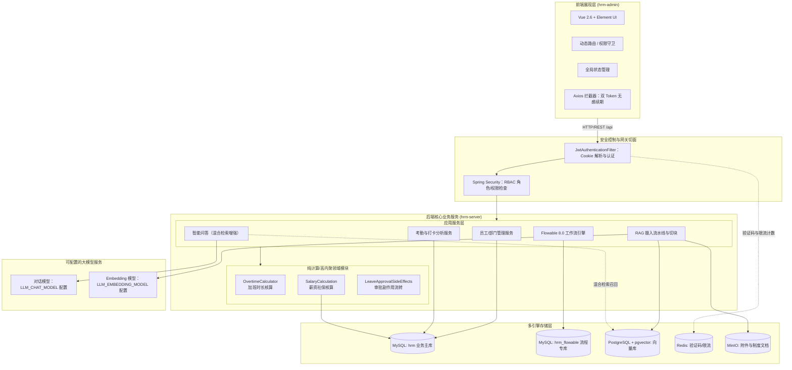

<!--
  微信公众号发布参考信息（HTML 注释，不会渲染到正文）

  【标题候选】（公众号标题上限 64 字）
  1. 从零手写数智人事系统（一）：项目介绍与技术选型
  2. 开源一套数智人事系统：Flowable 审批流 + RAG 知识库 + 智能问答
  3. Spring Boot 3.4 + Vue 2.6 全栈 HRM：28 期从零到上线系列开更

  【摘要建议】（上限 120 字）
  一套前后端分离的开源人力资源系统：Flowable 审批流、纯计算领域模块、
  双 Token 无感续期，以及基于 pgvector 的企业知识库智能问答。本系列用 28 期
  把它从建工程骨架一路讲到部署上线。

  【封面建议】
  推荐 01-login.png（留白多，裁 2.35:1 不丢主体），信息量优先可选 02-dashboard.png：
  https://cdn.jsdelivr.net/gh/quuuuj/hrm@5f06498f73fd00480b9549d82c358494b97244fe/img/readme/01-login.png
  https://cdn.jsdelivr.net/gh/quuuuj/hrm@5f06498f73fd00480b9549d82c358494b97244fe/img/readme/02-dashboard.png
  封面需在公众号后台单独上传，正文中的图片链接仅供编辑器抓取转存。

  【发布链路】
  用 doocs/md（https://md.doocs.org）导入本文件 —— 它支持 mermaid 渲染，
  左侧放入后右侧实时预览，再一键复制到公众号后台。mdnice 不支持 mermaid，请勿使用。

  【发布前待办】
  智能问答截图 14-smart-qa.png 是旧版 views/chat/ 界面，现为 views/qa/chat/，
  发布前请重截一张新界面图片替换（建议存 img/article/01-项目介绍/ 并更新下方引用）。
-->

# 从零手写数智人事系统（一）：项目介绍与技术选型

市面上的后台管理系统教程一抓一大把，但大多数止于"能跑的 CRUD"。这个系列不一样：我要带你完整复盘一套**真实做完的**人力资源系统——从 `docker compose up` 起第一个中间件，到智能问答能回答"我今年的年假还剩几天"，一共 28 期。

这是第 1 期，先把摊子铺开：这套系统是什么、覆盖了哪些业务、技术选型背后的理由，以及整个系列会怎么讲。

## 这套系统是什么

**数智人事**是一套前后端分离的人力资源管理系统，覆盖传统人事业务闭环的同时，接入了生成式 AI 能力：

- **传统业务闭环**：组织架构、员工全生命周期档案、菜单与角色细粒度 RBAC 权限体系、Flowable 审批流转、考勤与打卡统计、加班与多维假期管理、薪资核算与五险一金配置。
- **智能化升级**：基于 RAG（检索增强生成）的企业知识库智能问答，带员工上下文感知，覆盖"年假怎么算""加班费基数是多少"这类政策咨询场景。

先上一组界面截图，让你对最终形态有个直观认识。

### 登录与首页

**登录界面**

**首页仪表盘（工作台与考勤日历）**

### 系统管理

**员工管理**

**部门管理**

**文件管理**

### 权限管理

**角色权限分配**

**菜单权限配置**

### 考勤与审批

**请假申请与审批**

**考勤表现分析**

**加班详情核算**

### 财务与社保

**员工薪资管理**

**参保城市与五险一金比例**

### 智能问答

**智能问答（会话与逐字输出）**

## 核心业务流程

两条主链路最值得先看懂：**请假审批**（走 Flowable 引擎，加班不走流程引擎、是直接核算）和**知识库问答**。

```mermaid
flowchart TD
    subgraph ApprovalFlow["1. 请假审批流转链路"]
        A1["员工端发起请假申请"] --> A2{"余额与天数校验"}
        A2 -- "校验通过" --> A3["写入业务申请表并启动 Flowable 流程"]
        A2 -- "校验不通过" --> A1
        A3 --> A4["HR / 主管依次接收审批任务"]
        A4 --> A5{"审批决策"}
        A5 -- "驳回" --> A6["更新业务单据状态为已驳回"]
        A5 -- "批准" --> A7["触发 LeaveApprovalSideEffects 副作用链"]
        A7 --> A8["扣减假期余额 / 增加调休时长"]
        A8 --> A9["写入考勤状态记录并推送站内通知"]
    end

    subgraph RagFlow["2. 知识库与智能问答链路"]
        B1["管理员上传制度文档"] --> B2["MinIO 原始文件存储"]
        B2 --> B3["ETL 管道：文档解析与切块"]
        B3 --> B4["Embedding 模型向量化"]
        B4 --> B5[("PostgreSQL pgvector 向量库")]

        C1["员工发起人事咨询"] --> C2["意图识别与问题改写"]
        C2 --> C4["混合检索：向量召回 + 关键词召回 RRF 融合"]
        C4 --> B5
        B5 --> C5["命中切块 ±1 邻窗扩展为上下文"]
        C5 --> C6["组合检索上下文与员工档案 Prompt"]
        C6 --> C7["大模型生成回答"]
        C7 --> C8["伪流式逐字推送给员工前端"]
    end
```

有两个细节先纠正一下你可能在其他介绍里见过的说法：审批链路里**只有请假走 Flowable**，加班是直接由 `OvertimeCalculator` 核算、不进流程引擎；问答链路的检索不是"纯语义向量检索"，而是**向量 + 关键词的 RRF 混合召回**，回答也不是真流式，是拿到 LLM 完整结果后逐字推的**伪流式**（第 24、25 期会讲为什么这么做）。

## 技术选型：为什么是这个组合

### 系统架构图

### 选型理由速览

| 组件 | 选型 | 理由（系列里会展开） |
| :--- | :--- | :--- |
| 后端框架 | Spring Boot 3.4.4 + Java 17 | 主流选型，Flowable 8 原生支持 Boot 3 |
| ORM | MyBatis-Plus 3.5.10 | 单表 CRUD 零 XML，多表关联写注解 SQL |
| 工作流 | Flowable 8.0 | Activiti 对 Boot 3 支持滞后，Flowable 原生适配 |
| 鉴权 | JWT 双 Token + HttpOnly Cookie | 防 XSS 窃取 Token，无感续期（第 7、8 期） |
| 权限 | Spring Security @PreAuthorize | 权限点存库、登录时装进 JWT claim，请求零查库 |
| 业务库 | MySQL 8.1（两库分离） | 业务主库 + Flowable 引擎专库，数据自治 |
| 向量库 | PostgreSQL 16 + pgvector | 不引入独立向量库，PG 一站式解决 |
| 缓存 | Redis 5.0 | 只做验证码和限流计数——登录态在 JWT 里，不上 Redis |
| 对象存储 | MinIO | S3 兼容，支持 `composeObject` 零拷贝分片合并 |
| 大模型 | OpenAI 兼容协议（DashScope） | 对话与 Embedding 同一家，换供应商只改配置 |
| 前端 | Vue 2.6 + Element UI 2.15 | 存量技术栈，稳定够用；重点是动态路由 + 权限指令 |

## 这个系列会怎么讲

28 期按真实开发顺序排，每期对应一个可以动手验证的产出：

- **阶段一 · 起手（1–4 期）**：项目介绍 → docker 一键起中间件 → 后端骨架 → 前端骨架
- **阶段二 · 地基（5–7 期）**：统一响应与枚举 → 三库 84 张表怎么分 → 双 Token 认证
- **阶段三 · 权限（8–10 期）**：前端无感续期 → RBAC 表与后端校验 → 动态路由
- **阶段四 · 基础模块（11–13 期）**：CRUD 范式 → 组织权限维护 → 考勤打卡
- **阶段五 · 工作流与计算（14–18 期）**：请假建模 → Flowable 落地 → 审批副作用 → 加班核算 → 薪资核算
- **阶段六 · 文件与异步（19–21 期）**：MinIO → 分片上传/秒传/断点续传 → 异步任务引擎
- **阶段七 · AI（22–25 期）**：知识库建模 → 摄入流水线 → 混合检索 → 智能问答
- **阶段八 · 收尾（26–28 期）**：三个真实故障复盘 → 架构复盘 → 部署上线

每期的结构固定：先一句话说清本期产出，再讲"为什么这么做"，贴关键代码，最后留个下期预告。配置类的代码会给可以照抄的完整版本，核心业务逻辑讲思路、贴真实源码的关键段。

## 项目地址

**GitHub**：https://github.com/quuuuj/hrm

如果这个项目对你有帮助，欢迎 Star。下期我们从环境开始：怎么用 `docker/local/docker-compose.yml` 一键起齐四个中间件，以及为什么三库初始化脚本要分 MySQL 两份、PostgreSQL 一份。
