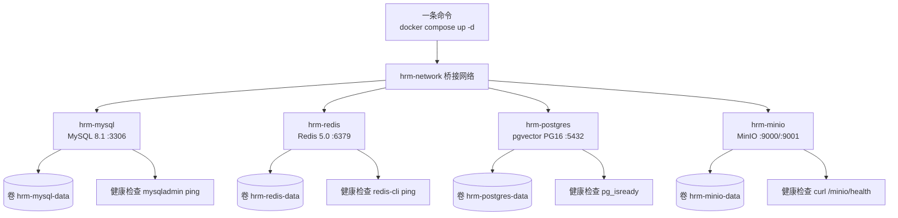

<!--
  微信公众号发布参考信息（HTML 注释，不会渲染到正文）

  【标题候选】（公众号标题上限 64 字）
  1. 从零手写数智人事系统（二）：一条命令起齐四个中间件
  2. 环境搭半天？这套项目 docker compose 一键起 MySQL/Redis/PG/MinIO
  3. 三库 84 张表怎么导入：手把手初始化本地开发环境

  【摘要建议】（上限 120 字）
  新手项目第一道坎不是写代码，是环境。本期用一份 90 行的 docker-compose
  文件起齐 MySQL、Redis、PostgreSQL（pgvector）、MinIO 四个中间件，导入
  三库共 84 张表，每一步都有可验证的结果。

  【封面建议】
  系列统一封面风格，继续用 01-login.png：
  https://cdn.jsdelivr.net/gh/quuuuj/hrm@5f06498f73fd00480b9549d82c358494b97244fe/img/readme/01-login.png
  封面需在公众号后台单独上传，正文中的图片链接仅供编辑器抓取转存。

  【发布链路】
  用 doocs/md（https://md.doocs.org）导入本文件 —— 它支持 mermaid 渲染，
  左侧放入后右侧实时预览，再一键复制到公众号后台。mdnice 不支持 mermaid，请勿使用。

  【发布前待办】
  本期无截图，验证输出均为代码块，无需新增图片。
-->

# 从零手写数智人事系统（二）：一条命令起齐四个中间件

上一期我们把整套系统的图纸看完了：前端、后端、三套数据库、工作流、AI 问答，一个不落。但图纸归图纸——今天回到最枯燥也最真实的第一步：把环境跑起来。

你可能会想：装环境有什么好讲的，不就是 `mysql -uroot -p` 吗？真不是。这套项目光数据库就有三份（两份 MySQL、一份带 pgvector 扩展的 PostgreSQL），加上 Redis 和 MinIO，一共四套中间件。版本要跟项目对齐、扩展要装、数据要能随时重建。用本机一个个装，一个上午就没了；用容器编排，一条命令，两分钟。

## 动手前提

读完第 1 期即可。本期是纯环境操作，不写代码；机器上装好 Docker Desktop 就行，不用另外安装任何数据库。

## 本期目标

一条 `docker compose up -d` 起齐 MySQL、Redis、PostgreSQL、MinIO，再把三库共 84 张表导入，并且每一步都能自己验证成功。

## 为什么用 Docker 编排，而不是本机安装

"中间件编排"这个词先给个定义：**用一个声明式文件描述应用依赖的中间件，一条命令统一起停**——本期的主角就是这份文件。我一开始也想过直接本机装，但很快发现三个绕不开的问题。

**第一是版本对齐。** 项目用的 MySQL 是 8.1，Redis 是 5.0，PostgreSQL 是 16 并且要带 pgvector 扩展。PG 官方镜像不带这个扩展，本机装要自己编译，这是新手最容易卡住的地方。而镜像 `pgvector/pgvector:pg16` 开箱就有。

**第二是可重复。** 同事换电脑、你重装系统，再走一遍"装四套中间件"？用编排文件的话，clone 仓库、一条命令，环境完全一致，版本自动对齐。

**第三是可销毁。** 开发环境最大的美德是随时推倒重来：数据放在命名卷里，`docker compose down -v` 一键清空，数据库坏了不用修，直接重建再导一遍 SQL。

另外一个工程习惯值得一提：这份 compose 里所有值都直接写字面值（端口、账号、密码），不依赖 `.env`。因为这些都是绑死 localhost 的本地默认值，谈不上敏感；真正敏感的五个变量（JWT 密钥、大模型 API Key 等）下期讲 `.env` 时再说。

## 一条命令：docker/local/docker-compose.yml 全量照抄

这是本期唯一需要照抄的文件。注意它的位置：不是根目录的 `docker-compose.yml`，而是 `docker/local/docker-compose.yml`——本地编排入库，构建和部署编排属于私有资产不进仓库，这条规则后面会反复出现。

`docker/local/docker-compose.yml:1`：

```yaml
# 本地中间件：所有值直接写字面值，不依赖 .env
# 启动命令：docker compose -f docker/local/docker-compose.yml up -d

services:
  mysql:
    image: mysql:8.1.0
    container_name: hrm-mysql
    environment:
      MYSQL_ROOT_PASSWORD: 123456
    ports:
      - "3306:3306"
    volumes:
      - hrm-mysql-data:/var/lib/mysql
    networks:
      - hrm-network
    healthcheck:
      test: ["CMD", "mysqladmin", "ping", "-h", "localhost"]
      interval: 10s
      timeout: 5s
      retries: 5
    restart: unless-stopped

  redis:
    image: redis:5.0
    container_name: hrm-redis
    command: redis-server
    ports:
      - "6379:6379"
    volumes:
      - hrm-redis-data:/data
    networks:
      - hrm-network
    healthcheck:
      test: ["CMD", "redis-cli", "ping"]
      interval: 10s
      timeout: 5s
      retries: 5
    restart: unless-stopped

  postgres:
    image: pgvector/pgvector:pg16
    container_name: hrm-postgres
    environment:
      POSTGRES_USER: hrm
      POSTGRES_PASSWORD: 123456
      POSTGRES_DB: hrm_kb
    ports:
      - "5432:5432"
    volumes:
      - hrm-postgres-data:/var/lib/postgresql/data
    networks:
      - hrm-network
    healthcheck:
      test: ["CMD-SHELL", "pg_isready -U hrm -d hrm_kb"]
      interval: 10s
      timeout: 5s
      retries: 5
    restart: unless-stopped

  minio:
    image: minio/minio:latest
    container_name: hrm-minio
    command: server /data --console-address ":9001"
    environment:
      MINIO_ROOT_USER: minioadmin
      MINIO_ROOT_PASSWORD: minioadmin
    ports:
      - "9000:9000"
      - "9001:9001"
    volumes:
      - hrm-minio-data:/data
    networks:
      - hrm-network
    healthcheck:
      test: ["CMD", "curl", "-f", "http://localhost:9000/minio/health/live"]
      interval: 10s
      timeout: 5s
      retries: 5
    restart: unless-stopped

volumes:
  hrm-mysql-data:
  hrm-redis-data:
  hrm-postgres-data:
  hrm-minio-data:

networks:
  hrm-network:
    driver: bridge
```

四个服务逐个看一眼配了什么。

**MySQL 8.1**（`docker/local/docker-compose.yml:5`）：root 密码 `123456` 直接写在 `environment`；数据落在命名卷 `hrm-mysql-data`，容器删了数据还在；健康检查用 `mysqladmin ping`，起好后 `docker ps` 里能看到 healthy。

**Redis 5.0**（`docker/local/docker-compose.yml:23`）：本地不设密码，和后端 `application.yml` 里的连接串保持一致——这也是"本地默认值不算敏感"的一个实例。健康检查 `redis-cli ping`。

**PostgreSQL + pgvector**（`docker/local/docker-compose.yml:40`）：镜像是 `pgvector/pgvector:pg16` 而不是 `postgres:16`，省掉编译扩展的坑；启动时通过环境变量直接创建了用户 `hrm`、密码 `123456`、数据库 `hrm_kb`。健康检查 `pg_isready`。

**MinIO**（`docker/local/docker-compose.yml:60`）：启动命令带了 `--console-address ":9001"`，所以它占两个端口——9000 是 S3 API，9001 是网页控制台，账号 `minioadmin/minioadmin`。

四个服务共用一个桥接网络 `hrm-network`、四个命名卷，并且都配了 `restart: unless-stopped`（开机自启，不用每天手拉）。结构示意：



在项目根目录执行：

```bash
docker compose -f docker/local/docker-compose.yml up -d
```

`-d` 是后台运行；`-f` 指定文件，因为这份文件不在根目录。首次启动要拉四个镜像，之后就是秒起。等十几秒，`docker ps` 里四个容器都 healthy，环境就绪。

## 导入三库：为什么是两份 MySQL 加一份 PostgreSQL

容器起好了，但里面的数据库还是空的——镜像只装了引擎，表结构在仓库的 `db/` 目录里。这里有个关键设计：初始化脚本不是一份，而是三份，对应三个库：

| 脚本 | 目标库 | 内容 |
| :--- | :--- | :--- |
| `db/mysql/hrm.sql` | MySQL `hrm` | 业务主库，25 张表，结构与种子数据一体 |
| `db/mysql/hrm_flowable.sql` | MySQL `hrm_flowable` | Flowable 引擎专库，55 张 `ACT_` 开头的引擎表 |
| `db/postgresql/knowledge_base.sql` | PostgreSQL `hrm_kb` | 知识库向量模式，4 张表 |

为什么这么分？

**Flowable 单独一库。** 工作流引擎会自建一大批 `ACT_` 开头的内部表（流程定义、运行实例、任务、历史），它们和业务单据（请假单、加班单）是两个生命周期的东西：业务表有逻辑删除、要关联员工表；引擎表是框架内部状态。混在一起，备份、清理、升级都互相牵制，分开各管各的。

**知识库单独一库，而且必须是 PostgreSQL。** 知识库的核心是向量检索，需要 pgvector 扩展，MySQL 干不了这个活；为它再引入一个独立向量库又太重，PG 加个扩展一站式解决。这份脚本第一句就是 `CREATE EXTENSION IF NOT EXISTS vector`，随后建 `vector_store` 表——embedding 列直接是 `vector(1024)`，1024 维对应 text-embedding-v3，第 22–24 期讲摄入和检索时还会回到这张表。

业务库 25 张表按前缀分了八组：`att_`（考勤请假加班 5 张）、`per_`（菜单角色 4 张）、`sal_`（薪资 2 张）、`soc_`（社保 2 张）、`sys_`（员工部门文档 3 张）、`chat_`（问答会话 2 张）、`file_`（文件任务 2 张）、`kb_`（知识库元数据 4 张），外加一张不带前缀的 `ingestion_jobs`。每组对应一个业务模块，第 6 期专门拆表设计，这里先混个脸熟。

另外注意：`hrm.sql` 每张表都是「`DROP TABLE IF EXISTS` + 建表 + INSERT」三段式，结构与种子数据一体。也就是说导入完成的那一刻，库里就已经有了组织架构、考勤记录和一批员工账号（包括默认管理员 `admin`，密码 `123456`），第 3 期起好后端就能直接登录。

导入命令推荐 docker exec 版本，不依赖本机装任何客户端：

```bash
# 1. 先建库——两个 SQL 文件本身都不含建库语句，这是新手第一坑
docker exec -i hrm-mysql mysql -uroot -p123456 -e \
  "CREATE DATABASE IF NOT EXISTS hrm DEFAULT CHARACTER SET utf8mb4;
   CREATE DATABASE IF NOT EXISTS hrm_flowable DEFAULT CHARACTER SET utf8mb4;"

# 2. 导入业务库与流程库
docker exec -i hrm-mysql mysql -uroot -p123456 hrm < db/mysql/hrm.sql
docker exec -i hrm-mysql mysql -uroot -p123456 hrm_flowable < db/mysql/hrm_flowable.sql

# 3. 导入知识库模式
docker exec -i hrm-postgres psql -U hrm -d hrm_kb < db/postgresql/knowledge_base.sql
```

README 里的原版命令用的是本机 mysql/psql 客户端，效果一样；没装客户端就用上面这版。

为什么不把 SQL 挂到容器的 `/docker-entrypoint-initdb.d/` 让它首次启动自动导入？那个目录只在数据卷第一次初始化时执行一次，之后改结构、加种子都不再生效。而这个项目的初始化脚本是「全量最终结构 + 种子」的形态，手动导入随时可覆盖重跑，更符合开发期的节奏——这也是没有引入 Flyway 这类迁移工具的原因，第 6 期会回到这个话题。

## 日常操作速查

这套环境之后每期都会用，把常用命令放一起：

```bash
# 启动 / 停止
docker compose -f docker/local/docker-compose.yml up -d     # 启动（幂等，已起则跳过）
docker compose -f docker/local/docker-compose.yml stop      # 停容器，保留数据卷
docker compose -f docker/local/docker-compose.yml down      # 删容器，保留数据卷
docker compose -f docker/local/docker-compose.yml down -v   # 连数据卷一起删，慎用

# 查看状态与日志
docker ps                                                    # 看 healthy 状态
docker logs -f hrm-mysql                                     # 跟踪某个容器日志

# 只重启一个服务
docker compose -f docker/local/docker-compose.yml restart postgres

# 进容器里直接操作
docker exec -it hrm-mysql mysql -uroot -p123456
```

四个容器常驻大概占 1GB 内存，不开发时 `stop` 掉即可，下次 `up -d` 秒回。

## 验证：每一步都要看到结果

```bash
# 4 个容器都是 healthy
docker ps

# 两个 MySQL 库的表数：应为 25 和 55
docker exec hrm-mysql mysql -uroot -p123456 -N -e \
  "SELECT table_schema, COUNT(*) FROM information_schema.tables
   WHERE table_schema IN ('hrm','hrm_flowable') GROUP BY table_schema;"

# PostgreSQL：应列出 4 张表，且扩展列表里有 vector
docker exec hrm-postgres psql -U hrm -d hrm_kb -c "\dt"
docker exec hrm-postgres psql -U hrm -d hrm_kb -c "SELECT extname FROM pg_extension;"

# 种子数据在不在：员工表行数
docker exec hrm-mysql mysql -uroot -p123456 -N -e "SELECT COUNT(*) FROM hrm.sys_staff;"
```

最后打开 MinIO 控制台 http://localhost:9001，用 `minioadmin/minioadmin` 登录，会看到一个空空的桶列表——别急，第 19 期讲文件存储时它就会派上用场。

## 小坑提醒

- 两个 MySQL 脚本不含建库语句，一定先建库再导入，否则报 `Unknown database`。
- PowerShell 的 `<` 重定向行为和 Linux 不同，以上命令建议在 Git Bash 里跑（这个项目的默认 shell 就是它）。
- 导错了想重来：直接重导即可，`hrm.sql` 开头会 DROP 旧表，自带幂等。
- `docker compose down -v` 会连命名卷一起删，数据全没。这既是"随时推倒重来"的武器，也是手滑的代价，按之前先想清楚。

## 小结

到这一步，你手上有一个可以随时重建的本地环境：四个中间件在 `hrm-network` 里互相可见，84 张表就位，`admin` 账号躺在库里。下一期开始写代码：Spring Boot 骨架怎么搭、三个数据源怎么在 `application.yml` 里声明、swagger-ui 怎么打开——环境这关，我们过了。

**GitHub**：https://github.com/quuuuj/hrm

如果这个项目对你有帮助，欢迎 Star。
