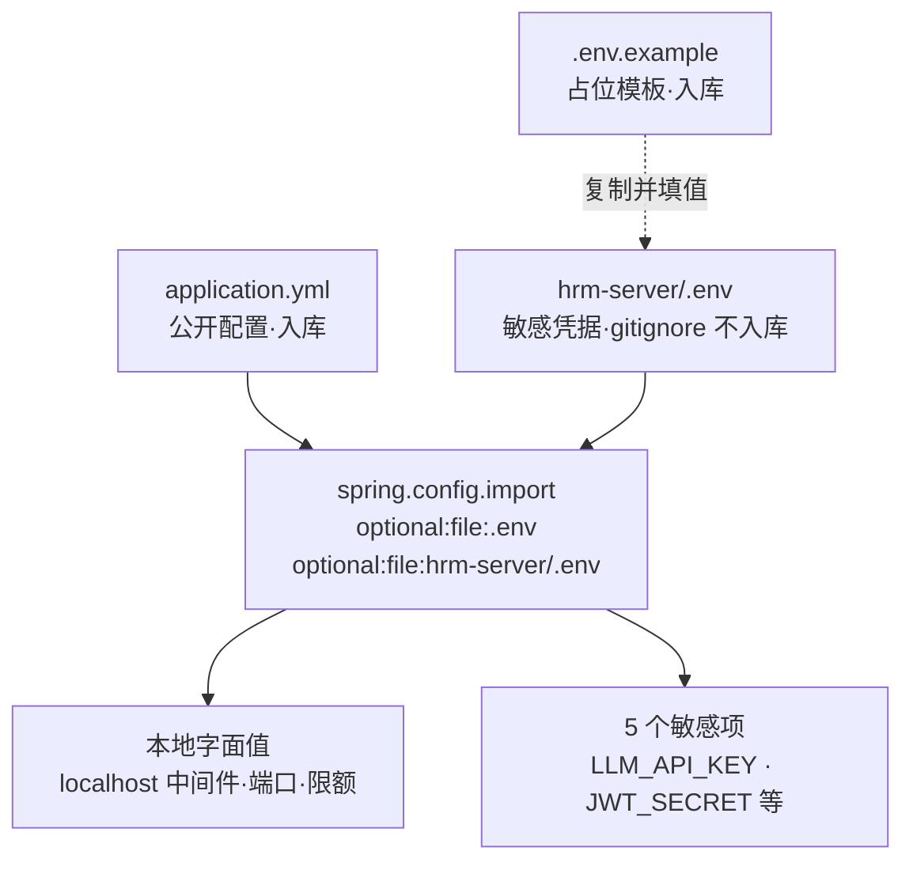

<!--
  微信公众号发布参考信息（HTML 注释，不会渲染到正文）

  【标题候选】（公众号标题上限 64 字）
  1. 从零手写数智人事系统（三）：Spring Boot 3.4 骨架与配置分层
  2. 拒绝配置满天飞：一套干净的 Spring Boot 多数据源与 .env 隔离方案
  3. 后端脚手架怎么搭：pom.xml 依赖治理与 spring.config.import 实战

  【摘要建议】（上限 120 字）
  中间件就绪后，本期开始搭后端骨架。通过父 POM 与 BOM 统一治理依赖，
  用 Spring Boot 3.4 原生 spring.config.import 实现敏感项与本地字面值彻底解耦，
  配齐三数据源并让 Swagger UI 顺利亮屏。

  【封面建议】
  系列统一封面风格，继续用 01-login.png 或 02-dashboard.png：
  https://cdn.jsdelivr.net/gh/quuuuj/hrm@5f06498f73fd00480b9549d82c358494b97244fe/img/readme/01-login.png
  封面需在公众号后台单独上传，正文中的图片链接仅供编辑器抓取转存。

  【发布链路】
  用 doocs/md（https://md.doocs.org）导入本文件 —— 它支持 mermaid 渲染，
  左侧放入后右侧实时预览，再一键复制到公众号后台。mdnice 不支持 mermaid，请勿使用。

  【发布前待办】
  本期无截图，验证输出均为终端日志与代码块，无需新增外部图片。
-->

# 从零手写数智人事系统（三）：Spring Boot 3.4 骨架与配置分层

上一期我们通过一条 `docker compose` 命令把 MySQL、Redis、PostgreSQL、MinIO 四套中间件跑了起来，并把三库 84 张表全部导入就位。地基挖好了，今天正式开始砌墙——搭出后端的工程骨架。

许多开发者在新建项目时，往往习惯直接勾选一堆 Starter，然后把数据库账密、三方密钥随手塞进 `application.properties` 里。项目小的时候还能跑，一旦涉及到多数据源、工作流引擎、AI 向量库、权限校验，依赖冲突和配置漂移就会把人折腾得焦头烂额。今天我们就把这套后端的脚手架一次性理顺。

## 动手前提

需完成第 2 期：中间件已在后台运行（`docker ps` 均处于 healthy 状态），且三库表结构已成功导入。本机环境需安装 JDK 17 与 Maven 3.8+。

## 本期目标

搭建起 `hrm-server` 的后端骨架，理清依赖与多环境配置分层，启动 Spring Boot 3.4，并在浏览器中成功打开 `http://localhost:8888/swagger-ui.html` 看到接口文档。

## 依赖治理：父 POM、BOM 与插件分工

在大型或复合型项目中，依赖版本混乱是团队协作的第一大杀手。为了从根本上避免版本地狱，项目采用「父 POM + BOM」两级依赖管理机制。

这里先给一个新术语下定义：**BOM（Bill of Materials，物料清单）** 是一个专门用来集中声明第三方组件及其所有子模块兼容版本的 POM 文件，它只做版本锁定，自身不引入任何实际 jar 包。

看 `hrm-server/pom.xml:7` 的顶层定义：

```xml
    <parent>
        <groupId>org.springframework.boot</groupId>
        <artifactId>spring-boot-starter-parent</artifactId>
        <version>3.4.4</version>
        <relativePath/>
    </parent>
```

Spring Boot 3.4.4 作为父工程，锁定了 Spring 全家桶、Tomcat、Jackson、SLF4J 等数百个基础组件的版本。但我们还要接入 Spring AI 和集成测试容器，这两个生态有各自独立的发布节奏，不能由 Spring Boot 父 POM 全权代劳。

因此在 `hrm-server/pom.xml:31` 中，使用 `<dependencyManagement>` 导入了对应的 BOM：

```xml
    <dependencyManagement>
        <dependencies>
            <dependency>
                <groupId>com.alibaba.cloud.ai</groupId>
                <artifactId>spring-ai-alibaba-bom</artifactId>
                <version>${spring-ai-alibaba.version}</version>
                <type>pom</type>
                <scope>import</scope>
            </dependency>
            <dependency>
                <groupId>org.testcontainers</groupId>
                <artifactId>testcontainers-bom</artifactId>
                <version>1.21.3</version>
                <type>pom</type>
                <scope>import</scope>
            </dependency>
        </dependencies>
    </dependencyManagement>
```

在实际依赖列表中，有几个关键组件的选型值得重点说明：

1. **Spring AI OpenAI Starter**（`hrm-server/pom.xml:115`）：
   ```xml
   <dependency>
       <groupId>org.springframework.ai</groupId>
       <artifactId>spring-ai-starter-model-openai</artifactId>
       <version>1.0.0</version>
   </dependency>
   ```
   很多新手以为接通义千问就必须用 `spring-ai-alibaba-starter-dashscope`，我最初也这么做过，但踩到了大坑：那个 Starter 会自动注册一个 `DashScopeChatModel`，与通用的 `OpenAI ChatModel` 产生双 Bean 竞争，而且它硬编码默认模型 `qwen-plus`，在免费额度耗尽时直接报 403 并触发退避重试，导致智能问答 SSE 接口长达数分钟假死。换成标准的 OpenAI 兼容客户端，走 DashScope 的 `/compatible-mode` 端点，不仅行为完全可控，后续切换任何大模型供应商也只需改一行配置。

2. **Flowable 8.0.0 与排除项**（`hrm-server/pom.xml:315`）：
   ```xml
   <dependency>
       <groupId>org.flowable</groupId>
       <artifactId>flowable-spring-boot-starter</artifactId>
       <version>8.0.0</version>
       <exclusions>
           <exclusion>
               <artifactId>mybatis</artifactId>
               <groupId>org.mybatis</groupId>
           </exclusion>
           <exclusion>
               <artifactId>commons-io</artifactId>
               <groupId>commons-io</groupId>
           </exclusion>
       </exclusions>
   </dependency>
   ```
   Activiti 在 Spring Boot 3 下支持脱节，而其原班人马打造的 Flowable 8 原生完美适配 Boot 3。但 Flowable 内部自带原生 MyBatis，必须将其显式排除，交由外层的 `mybatis-plus-spring-boot3-starter:3.5.10` 统一接管，否则运行时会出现 SqlSessionFactory 重复创建与类型转换异常。

3. **双测试插件隔离**（`hrm-server/pom.xml:349`）：
   ```xml
   <plugin>
       <groupId>org.apache.maven.plugins</groupId>
       <artifactId>maven-surefire-plugin</artifactId>
       <version>3.5.3</version>
       <configuration>
           <includes><include>**/*UnitTest.java</include></includes>
       </configuration>
   </plugin>
   <plugin>
       <groupId>org.apache.maven.plugins</groupId>
       <artifactId>maven-failsafe-plugin</artifactId>
       <version>3.5.3</version>
       <configuration>
           <includes><include>**/*IntegrationTest.java</include></includes>
       </configuration>
   </plugin>
   ```
   项目严格区分了两种测试：**单元测试**（`*UnitTest.java`）完全不加载 Spring 容器，几毫秒内跑完纯静态计算；**集成测试**（`*IntegrationTest.java`）通过 Testcontainers 动态拉起容器进行真实数据库交互。两个插件让两者物理隔离，日常开发随时 `mvn test -Dtest=*UnitTest` 秒级看结果，不会被笨重的容器测试拖慢节奏。

## 配置分层：本地字面值与 .env 敏感项隔离

搞定依赖后，面临的下一个问题是：配置该写在哪？

传统方案喜欢搞 `application-dev.yml`、`application-test.yml`、`application-prod.yml`，然后用 `spring.profiles.active` 切换。这种方案有两大痛点：一是配置分散，改一个参数要同步改三四个文件；二是开发者极容易手滑把带有真实服务器 IP 或生产数据库密码的配置文件推上 GitHub。

这套系统采用了更加整洁的现代化策略：**本地默认值全部字面值化，仅敏感项收敛至 .env 文件。**

这里引入第二个术语定义：**`.env 敏感项`** 指的是 API 密钥、JWT 签名私钥等一旦脱离本机内网仍可被恶意利用的凭据。

而绑死在 `localhost:3306`、密码为 `123456` 的本地 MySQL 凭据，或者单次请求大小限制等参数，脱离本机毫无攻击面，全部直接作为字面值写入唯一的 `application.yml`。

### spring.config.import 的双路径注入

看 `hrm-server/src/main/resources/application.yml:5`：

```yaml
spring:
  config:
    import: optional:file:.env[.properties],optional:file:hrm-server/.env[.properties]
```

Spring Boot 2.4+ 引入的 `spring.config.import` 是一个神器。通过上述配置，Spring 启动时会自动尝试读取 `.env` 并按 Properties 格式解析键值对。

为什么要写两个路径？
- 无论你在项目根目录执行 `mvn -pl hrm-server spring-boot:run`；
- 还是先 `cd hrm-server` 再执行 `mvn spring-boot:run`；
- 或者直接在 IDEA 里右键启动 `HrmApplication`；
双路径设计都能保证正确找到 `.env` 文件。前面的 `optional:` 前缀非常关键：即便本地暂时没有 `.env`，应用也不会直接报致命错误崩溃。

整个配置分层与注入机制如下所示：



### 收敛后的 .env 只有 5 项

看 `hrm-server/.env.example:1`，整个仓库需要外部注入的变量被严格收敛到了 5 个：

```properties
# LLM（chat 与知识库 embedding 共用；OpenAI 兼容模式）
LLM_API_KEY=<API密钥>
LLM_BASE_URL=https://dashscope.aliyuncs.com/compatible-mode
LLM_CHAT_MODEL=qwen3.7-flash
LLM_EMBEDDING_MODEL=qwen3.7-text-embedding

# JWT 签名密钥
JWT_SECRET=REPLACE_WITH_BASE64_JWT_SECRET
```

在本地开发时，把 `.env.example` 复制一份为 `hrm-server/.env`，填入你自己的 DashScope 密钥和一段随机的 JWT 密钥即可，其他所有数据库、缓存、对象存储参数全部无需配置。

## 多数据源与 Flowable 隔离配置

前面说过，系统拥有三套独立的数据库。在 `hrm-server/src/main/resources/application.yml:8` 中定义了三个连接池：

```yaml
  datasource:
    master:
      jdbc-url: jdbc:mysql://localhost:3306/hrm?useUnicode=true&characterEncoding=utf-8&serverTimezone=Asia/Shanghai
      username: root
      password: 123456
      driver-class-name: com.mysql.cj.jdbc.Driver
      type: com.zaxxer.hikari.HikariDataSource
    flowable:
      jdbc-url: jdbc:mysql://localhost:3306/hrm_flowable?useUnicode=true&characterEncoding=utf-8&serverTimezone=Asia/Shanghai
      username: root
      password: 123456
      driver-class-name: com.mysql.cj.jdbc.Driver
      type: com.zaxxer.hikari.HikariDataSource
    kb:
      jdbc-url: jdbc:postgresql://localhost:5432/hrm_kb
      username: hrm
      password: 123456
      driver-class-name: org.postgresql.Driver
      type: com.zaxxer.hikari.HikariDataSource
```

在 Java 代码侧，如何将这三个数据源各就其位？看 `DataSourceConfig.java`（`hrm-server/src/main/java/com/qiujie/config/DataSourceConfig.java:16`）：

```java
@Configuration
public class DataSourceConfig {

    @Primary
    @Bean
    @ConfigurationProperties(prefix = "spring.datasource.master")
    public DataSource masterDataSource() {
        return DataSourceBuilder.create().build();
    }

    /**
     * 为主数据源显式配置事务管理器，确保 @Transactional 正确提交。
     * 多数据源场景下 Spring Boot 可能不确定用哪个 TransactionManager。
     */
    @Primary
    @Bean
    public PlatformTransactionManager transactionManager(
            @Qualifier("masterDataSource") DataSource dataSource) {
        return new DataSourceTransactionManager(dataSource);
    }

    @Bean
    @ConfigurationProperties(prefix = "spring.datasource.flowable")
    public DataSource flowableDataSource() {
        return DataSourceBuilder.create().build();
    }

    @Bean
    @ConfigurationProperties(prefix = "spring.datasource.kb")
    public DataSource kbDataSource() {
        return DataSourceBuilder.create().build();
    }

    /**
     * 让 Flowable 使用独立的 flowable 数据源，而非主数据源
     */
    @Bean
    public EngineConfigurationConfigurer<SpringProcessEngineConfiguration> engineConfigurationConfigurer(
            @Qualifier("flowableDataSource") DataSource dataSource) {
        return config -> config.setDataSource(dataSource);
    }
}
```

这里有两个极为关键的工程细节：
1. **显式声明 `@Primary PlatformTransactionManager`**：当 Spring 上下文出现多个 DataSource 时，如果不显式声明一个主事务管理器，业务代码里标注的 `@Transactional` 会因为找不到唯一的 TransactionManager 而退化或报错。
2. **`EngineConfigurationConfigurer` 钩子**：Flowable 官方 Starter 默认会自动抓取上下文中的 `@Primary` 数据源。为了将流程引擎隔离到独立的 `hrm_flowable` 库中，必须注册 `EngineConfigurationConfigurer`，强行将它的底层连接替换为 `flowableDataSource`。

## application.yml 的分块策略

三个数据源只是这份配置文件的前八行。剩下还有几块同样需要交代清楚，整份文件按职责切成了七块，从上到下依次是：`spring`（数据源/上传限额/Redis/Spring AI）、`server`、`flowable`、`mybatis-plus`、`management`、`jwt`+业务开关、`logging`。

**关闭用不到的 Flowable 引擎模块**（`hrm-server/src/main/resources/application.yml:59`）：

```yaml
flowable:
  database-schema-update: true
  dmn:
    enabled: false
  form:
    enabled: false
  app:
    enabled: false
  content:
    enabled: false
```

Flowable 除了流程引擎，还自带决策表（DMN）、表单、应用、内容管理四个独立引擎。它们默认全开，启动时会各自去建一大批表。这套系统只用流程引擎，所以其余四个显式关掉——数据库里能少建几十张表，启动也快一截。`database-schema-update: true` 则是让引擎启动时自动比对并补齐自己的表结构，所以第 2 期导入 `hrm_flowable.sql` 后，这里的表不会打架。

**MyBatis-Plus 的两项约定**（`hrm-server/src/main/resources/application.yml:70`）：

```yaml
mybatis-plus:
  configuration:
    log-impl: org.apache.ibatis.logging.nologging.NoLoggingImpl
  type-enums-package: com.qiujie.*.enums
```

`type-enums-package` 是这套项目里很关键的一条：它让 MyBatis-Plus 自动扫描所有业务包下的 `enums/` 目录并注册枚举转换器，于是实体里可以直接用枚举类型接数据库里的数字字段，不用手写任何 `TypeHandler`。第 5 期讲 `BaseEnum` 时会专门展开。`log-impl` 设为 `NoLoggingImpl` 是因为项目自带了更细的日志分层，不想让 MyBatis 把每条 SQL 都刷一遍。

**只暴露健康检查**（`hrm-server/src/main/resources/application.yml:76`）：

```yaml
management:
  endpoints:
    web:
      exposure:
        include: health
  endpoint:
    health:
      show-details: never
      probes:
        enabled: true
```

Actuator 默认只暴露 `health` 和 `info`，这里进一步显式收窄到只有 `health`，且 `show-details: never` 保证不会把数据库地址、连接池状态之类的内部信息吐给匿名请求——因为验收脚本和容器编排都靠 `/actuator/health` 探活，这个端点必须在 Security 里放行，那就更得管住它说什么。`probes.enabled: true` 则打开 Kubernetes 风格的 `liveness`/`readiness` 子端点，第 28 期讲部署时的容器健康检查就是打这个地址。

最后一块 `logging` 是本地开发专属的调试开关：

```yaml
logging:
  level:
    com.qiujie: debug
    org.springframework.ai.openai: TRACE
    org.springframework.web.client.RestClient: DEBUG
```

把业务包设为 `debug`，把 Spring AI 的 OpenAI 客户端和底层 HTTP 调用开成 `TRACE`/`DEBUG`——第 22 期往后调大模型时，请求体里到底发了什么 prompt、模型原样返回了什么，全靠这一行日志看得见。上线时记得收回去。

## 启动类与 SpringDoc OpenAPI 放行

核心入口类 `HrmApplication.java`（`hrm-server/src/main/java/com/qiujie/HrmApplication.java:12`）：

```java
@MapperScan({"com.qiujie.*.mapper"})
@SpringBootApplication
@EnableTransactionManagement(proxyTargetClass = true) // CGLIB 代理确保实现类 @Transactional 生效
@EnableScheduling
@EnableAsync
@EnableRetry
public class HrmApplication {
    public static void main(String[] args) {
        SpringApplication.run(HrmApplication.class, args);
    }
}
```

注意 `@MapperScan({"com.qiujie.*.mapper"})`，它保证了后续按业务特性分包（package-by-feature）后，所有模块下的 Mapper 都能被 MyBatis-Plus 自动发现并注册为 Bean。

为了让 API 文档可以免登录直接查看，在 `SecurityConfig.java:74` 中明确对 SpringDoc 资源进行了放行：

```java
.authorizeHttpRequests(auth -> auth
    .requestMatchers("/login/**", "/validate/code", "/refresh", "/logout", "/actuator/health/**").permitAll()
    .requestMatchers("/swagger-ui/**", "/v3/api-docs/**", "/webjars/**").permitAll()
    .anyRequest().authenticated()
)
```

## 动手验证：让工程真正跑起来

### 1. 准备本地敏感项文件

在 `hrm-server/` 目录下创建 `.env`（可直接从 `.env.example` 复制）：

```bash
cp hrm-server/.env.example hrm-server/.env
```

打开 `hrm-server/.env`，设置一个长度足够的 JWT 签名密钥（如 `dGhpcy1pcy1hLXNhbXBsZS1qd3Qtc2VjcmV0LWtleS1mb3ItaHJtLXByb2plY3Q=`，大模型 API 密钥暂时留空不影响基础骨架启动）。

### 2. 编译并启动后端服务

在 `hrm-server/` 目录下执行：

```bash
mvn spring-boot:run
```

当控制台打印出如下标志性日志时，说明骨架已成功加载所有数据源与引擎：

```text
2026-09-26T10:00:00.123+08:00  INFO 12345 --- [hrm-server] [           main] o.f.s.b.ProcessEngineAutoConfiguration   : Starting Flowable Engine...
2026-09-26T10:00:02.456+08:00  INFO 12345 --- [hrm-server] [           main] o.s.b.w.embedded.tomcat.TomcatWebServer  : Tomcat started on port 8888 (http) with context path '/'
2026-09-26T10:00:02.458+08:00  INFO 12345 --- [hrm-server] [           main] com.qiujie.HrmApplication                : Started HrmApplication in 3.824 seconds
```

### 3. 验证端点连通性

打开终端或浏览器进行两项检查：

```bash
# 检查健康检查探测点（返回 {"status":"UP"}）
curl -s http://localhost:8888/actuator/health
```

接着在浏览器打开：
`http://localhost:8888/swagger-ui.html`

如果页面能正常渲染出 SpringDoc OpenAPI 的 Swagger UI 界面（右上角显示 `OpenAPI 3.0`），说明整个 Spring Boot 3.4 WebMVC、SpringDoc 资源映射、Security 白名单过滤链已经全线打通。

## 小坑提醒

- **swagger-annotations 版本冲突**：`spring-ai-alibaba` 默认依赖传递了较旧的 swagger-annotations 2.2.25，而 springdoc 2.8.10 运行时需要调用 `Schema.$dynamicRef()`（2.2.26+ 引入）。如果启动报错 `NoSuchMethodError`，需在 `pom.xml` 中像本项目一样显式声明 `swagger-annotations: 2.2.28` 覆盖掉传递依赖。
- **.env 的换行与空格**：在 Windows 系统下复制 `.env` 时，注意不要在密钥末尾携带多余的空格或隐藏不可见字符，否则 Base64 解码会抛出非法的字符异常。
- **Flowable 引擎表自动更新**：`application.yml` 中配置了 `flowable.database-schema-update: true`。初次启动时它会检查数据源中的表结构，必须确保上一期 `hrm_flowable` 库已经初始化完毕。

## 小结

到这一步，后端工程骨架已经稳稳立住：
1. 通过 BOM 和排除项化解了 Spring AI、Flowable、MyBatis-Plus 之间的隐式冲突；
2. 实现了多数据源自治隔离；
3. 用 `spring.config.import` 划清了安全红线，本地开箱即用，敏感凭据永不上库。

后端地基打好之后，下一期我们转向前端——看看如何用 Vue 2.6 + Element UI 搭建起 `hrm-admin` 骨架，通过开发服务器代理（Proxy）调通与本期 8888 端口的跨域通信，并搭起 Axios 拦截器雏形。

**GitHub**：https://github.com/quuuuj/hrm

如果这个项目对你有帮助，欢迎 Star。
