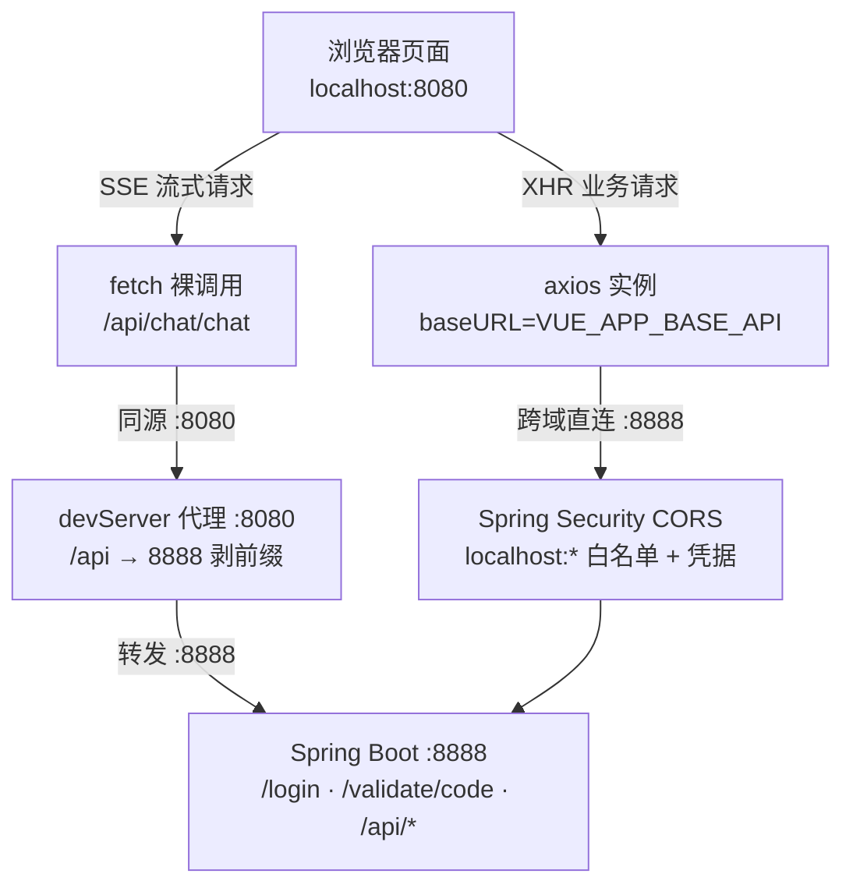

<!--
  微信公众号发布参考信息（HTML 注释，不会渲染到正文）

  【标题候选】（公众号标题上限 64 字）
  1. 从零手写数智人事系统（四）：Vue 2.6 前端骨架与开发代理调通
  2. 前后端分离第一课：用 devServer 代理干掉跨域，顺手搭好 Axios 与 Vuex 骨架
  3. npm run serve 背后发生了什么：一个中型 Vue 项目的脚手架拆解

  【摘要建议】（上限 120 字）
  后端 8888 端口就绪后，本期搭起 hrm-admin 前端骨架：一个 .env 变量串起
  devServer 代理与 Axios baseURL，让浏览器请求与后端同源、Cookie 自然携带；
  再按职责切出五个 Vuex 模块，登录页一把调通。

  【封面建议】
  系列统一封面风格，沿用第 2/3 期的登录页截图：
  https://cdn.jsdelivr.net/gh/quuuuj/hrm@5f06498f73fd00480b9549d82c358494b97244fe/img/readme/01-login.png
  封面需在公众号后台单独上传，正文中的图片链接仅供编辑器抓取转存。

  【发布链路】
  用 doocs/md（https://md.doocs.org）导入本文件 —— 它支持 mermaid 渲染，
  左侧放入后右侧实时预览，再一键复制到公众号后台。mdnice 不支持 mermaid，请勿使用。

  【发布前待办】
  1. 「动手验证」一节如需登录页截图，可复用上面 01-login.png（已验证 200）；
     若想截当前界面新图，发布后先推送 img/article/04-前端骨架/ 再以钉死 SHA 引用。
  2. jsDelivr 图片 URL 已逐个 curl 验证 200（SHA=5f06498... 远端 dev HEAD）。
-->

# 从零手写数智人事系统（四）：Vue 2.6 前端骨架与开发代理调通

上一期我们把 Spring Boot 3.4 的后端骨架跑了起来，`8888` 端口已经能正常应答。但光有后端没有界面，就像盖好了毛坯房却没装门窗——今天给这套系统装上"门面"：搭起 `hrm-admin` 前端工程，并把前后端之间那条最容易踩坑的通路一次调顺。

前后端分离项目的第一道坎永远是：**浏览器在 8080，后端在 8888，请求怎么过去？Cookie 怎么带上？** 很多教程到这里就开始堆 CORS 配置、教你在每个请求头里塞 Token，结果越搞越复杂。这套项目只用了一个开发服务器代理加一个小小的约定，就把问题解决了。

## 动手前提

需完成第 3 期：后端已在 `http://localhost:8888` 运行，`/actuator/health` 返回 UP。本机需安装 Node.js（本项目在 Node 18+ 下验证）与 npm。

## 本期目标

`npm run serve` 成功启动前端开发服务器（默认 8080 端口），通过代理调通后端：打开 `http://localhost:8080/login`，验证码图片正常加载，输入默认账号 `admin` / `123` 能完成登录、拿到后端写入的 Cookie。

## 为什么是 Vue 2.6 + Element UI

先说选型。这套前端用的是 **Vue 2.6 + Element UI 2.15 + Vue CLI 4.5**——一个今天看来不算新潮的组合。原因很朴素：项目主体写于 2022 年，这是当时中后台管理系统最稳的搭配。整套教程如实还原这个技术栈，不追新——把骨架、代理、状态管理这些"怎么搭"想清楚，比框架版本号重要得多，换成 Vue 3 + Element Plus 思路完全一样。

## 一个变量管住两条路：.env 与 devServer 代理

先引入本期第一个新术语：**代理（Proxy）**，指开发服务器充当"中间人"——浏览器把请求发给同源的 devServer（8080），由它在服务器侧转发给真正的后端（8888），浏览器全程感知不到跨域。

理解这套方案的关键，是先想明白一件事：前端到后端其实有**两条通路**。

- **通路一（XHR 请求）**：`axios` 发出 `baseURL + url` 的请求，目标地址是 `http://localhost:8888` ——这是跨域请求，靠后端第 3 期配好的 CORS 白名单放行；
- **通路二（devServer 代理）**：浏览器发出 `http://localhost:8080/api/xxx` 的同源请求，由 devServer 转发到 8888——不经过浏览器跨域检查，Cookie 也是第一方上下文，天然顺畅。

两条通路指向同一个后端，但各需要一个"后端在哪"的配置。如果各写各的，改端口时就要改两处——于是项目把它们收敛到了同一个 `.env` 变量族上。

`hrm-admin/.env`（不入库，仅本地）只有两行有效内容：

```properties
# 后端项目地址（devServer 代理与 API 请求共用的唯一变量）
VUE_APP_BASE_API=http://localhost:8888
# devServer 代理目标（与 VUE_APP_BASE_API 保持一致）
VUE_APP_BACKEND_TARGET=http://localhost:8888
```

以 `VUE_APP_` 开头的变量会被 Vue CLI 在构建/启动时注入 `process.env`，业务代码里直接读 `process.env.VUE_APP_BASE_API` 即可。注意这个注入发生在**启动期而非运行期**——改了 `.env` 必须重启 `npm run serve` 才生效。

代理规则写在 `hrm-admin/vue.config.js:7`：

```js
devServer: {
  headers: {
    'Permissions-Policy': 'unload=*' // Chrome 新版禁止 unload 事件，SockJS 需要此权限
  },
  proxy: {
    '/api': {
      target: process.env.VUE_APP_BACKEND_TARGET,
      pathRewrite: { '^/api': '' },
      changeOrigin: true
    }
  }
}
```

三个字段各司其职：`target` 是转发目的地；`pathRewrite` 把 `/api` 前缀剥掉再转发（`/api/login` → `8888/login`），后端因此不用统一加 `/api` 前缀；`changeOrigin: true` 让转发请求的 `Host` 头改成目标地址，某些校验 Host 的服务才肯应答。那行 `Permissions-Policy` 头是 Chrome 新版禁用 `unload` 事件后，devServer 热更新依赖的 SockJS 需要的放行——删掉它热更新会报权限警告。

两条通路的分工是：**XHR 走直连（CORS），SSE 走代理**。因为 EventSource/fetch 流式接口在同源代理下 Cookie 行为最省心，项目里智能问答的 SSE 请求写死了 `fetch('/api/chat/chat', ...)`（`hrm-admin/src/api/chat.js:28`），其余常规接口走 axios 的 `baseURL` 直连。整条调用链如下：



## Axios 实例：拦截器雏形先立住

有了通路，还需要一个统一的"出站口"。项目没有让各页面各自 `axios.get`，而是在 `hrm-admin/src/utils/request.js:7` 建了一个共享实例：

```js
const BASE_API = process.env.VUE_APP_BASE_API

const instance = axios.create({
  baseURL: BASE_API,
  timeout: 10000,
  withCredentials: true // 浏览器自动携带 httpOnly Cookie，无需手动加 token
})
```

`withCredentials: true` 是整个认证体系的地基：它告诉浏览器"跨域请求也请带上目标域的 Cookie"。后端登录成功后写入的 `token` Cookie 是 **httpOnly**——JS 读不到也改不了，天然免疫 XSS 偷 Token，代价是前端只能靠"浏览器自动携带"来证明身份，这一行配置就是开关。

请求拦截器只做一件事（`hrm-admin/src/utils/request.js:32`）：非 `FormData` 的请求统一补上 `Content-Type: application/json`。`FormData` 要刻意跳过——浏览器会自动生成带 `boundary` 的 multipart 头，手动覆盖反而会把文件上传搞坏。

响应拦截器（`hrm-admin/src/utils/request.js:45`）目前管三类事：**blob/arraybuffer 响应原样放行**（验证码图片、文件下载）；**401/1200 触发静默刷新**（并发请求排队只刷一次，这套"并发去重刷新"逻辑是第 8 期的主角，本期只需知道雏形已就位）；**400/500/1300 统一弹错误提示**。所有页面因此不用各自处理错误码。

## API 层：一个资源一个文件

实例之上，项目约定了很朴素的组织方式——`src/api/` 下**一个后端资源对应一个文件**，页面只 `import` 函数，不碰 URL 细节。看最典型的 `hrm-admin/src/api/login.js`：

```js
import request from '../utils/request'

// 登录
export const login = (data) => {
  return request({
    url: '/login/' + data.validateCode,
    method: 'post',
    data
  })
}

export const getValidateCode = () => {
  return request({
    url: '/validate/code',
    method: 'get',
    responseType: 'blob'
  })
}
```

注意 `url` 写的是**相对路径**——`/login/xxx` 会被拼到实例的 `baseURL` 后面，最终打到 8888。验证码接口的特殊性在于 `responseType: 'blob'`：后端返回的是 PNG 图片流，前端拿到 blob 后用 `URL.createObjectURL` 转成 `` 可显示的地址（`hrm-admin/src/utils/validateCode.js:5`）。

## Vuex 五模块：状态按职责分家

本期第二个新术语：**Vuex 模块（Module）**。当所有状态都堆在一个 store 里，很快就变成谁都不敢动的"全局变量坟场"；Vuex 允许把 store 切成带命名空间（`namespaced: true`）的模块，每个模块管自己那摊 state/mutation，外部用 `模块名/方法名` 调用。

`hrm-admin/src/store/index.js:13` 注册了五个模块，分工一眼可见：

| 模块 | 管什么 | 持久化到哪 |
|---|---|---|
| `token` | 登录态标志 `isAuth` | sessionStorage |
| `staff` | 当前登录人信息 | sessionStorage 存 staffId |
| `menu` | 左侧菜单树 + 折叠态 | 后端动态下发 |
| `permission` | 权限点字符串列表 | 后端动态下发 |
| `tag` | 顶部多页签 | localStorage |

最值得说的是 `token` 模块（`hrm-admin/src/store/modules/token.js:1`）——它里面**根本没有 token**：

```js
// token 存储在 httpOnly Cookie 中（JS 不可读），
// 前端只保留一个 isAuth 标志用于判断登录状态
const AUTH_KEY = 'isAuth'

export default {
  namespaced: true,
  state: {
    isAuth: sessionStorage.getItem(AUTH_KEY) === '1'
  },
  mutations: {
    SET_AUTH (state, val) {
      state.isAuth = val
      if (val) {
        sessionStorage.setItem(AUTH_KEY, '1')
      } else {
        sessionStorage.removeItem(AUTH_KEY)
      }
    }
  }
}
```

既然 httpOnly Cookie 读不到，前端判断"我登录了吗"只能靠一个自己立的"信标"：登录成功写入 `isAuth=1`，路由守卫和请求拦截器只看这个标志；真正的凭证永远躺在 Cookie 里由浏览器护送。为什么用 `sessionStorage` 而不是 `localStorage`？关掉浏览器标签就要求重新登录，会话边界更清晰——这是有意为之，不是随手选的。

## 入口装配与路由骨架

`hrm-admin/src/main.js:13` 做的事很少：全局注册 Element UI（`size: 'mini'` 是中后台的紧凑密度）、挂自定义指令、把 store 和 router 塞进根实例。

路由则埋着第 10 期的伏笔：`hrm-admin/src/router/index.js:17` 里**静态路由只有 `/login` 一条**。所有业务页面都不是写死的——登录成功后由后端菜单数据驱动 `setDynamicRoute(menuList)` 动态生成（`hrm-admin/src/router/index.js:33`），菜单有什么路由就有什么。本期只需知道骨架是这个形状，动态加载的细节留到权限篇展开。

## 动手验证：从 serve 到登录成功

### 1. 安装依赖并启动

```bash
cd hrm-admin
npm ci          # 按 package-lock.json 精确安装
npm run serve   # 启动 devServer，默认 :8080
```

看到 `App running at: - Local: http://localhost:8080/` 即启动成功。

### 2. 验证代理通路

不开页面也能先验证链路（后端需在跑）：

```bash
# 经 8080 代理拿验证码，应返回 PNG 图片流而非 404
curl -s -o /dev/null -w "%{http_code} %{content_type}" http://localhost:8080/api/validate/code
# 预期: 200 image/png
```

这一条 200 就证明了：devServer 代理通、`/api` 前缀正确剥离、后端 `/validate/code` 在 Security 白名单内。

### 3. 浏览器登录

打开 `http://localhost:8080/login`：验证码图片正常显示（blob 通路工作）、输入默认账号 `admin` / 密码 `123` + 验证码提交，跳转到 `/home` 即全链路打通。此时在 DevTools → Application → Cookies 里能看到 `localhost:8888` 域下的 `token` 与 `refreshToken` 两个 httpOnly Cookie——前端拿不到它们的值，但后续每个请求都会自动带上。

如果验证码刷不出来，先按 `F12` 看 Network：请求打到 `8888` 被标红（CORS 错误）说明后端没起来或白名单没配好；打到 `8080/api` 返回 404 说明代理没生效，多半是 `.env` 没建或没重启。

## 小坑提醒

- **`npm run serve` 报 `ERR_OSSL_EVP_UNSUPPORTED`**：Node 17+ 换了 OpenSSL 3，而 Vue CLI 4.5 的 webpack 4 还在用旧哈希算法。项目的解法写在 `hrm-admin/package.json:6`——启动命令显式加了 `--openssl-legacy-provider`，照抄即可，不用降级 Node。
- **改了 `.env` 没生效**：`VUE_APP_*` 变量是启动时注入的，热更新不会重读环境变量，改完必须重启 devServer。
- **`baseURL` 与代理别混用**：`request.js` 的 `baseURL` 是后端真实地址（走 CORS）；只有 SSE 那种需要同源上下文的请求才走 `/api` 代理。两边指向同一个后端，别手动把 `/api` 拼进 axios 的 url 里，那就变成 8888 直连 + 多了一段后端不认识的前缀。
- **验证码 `responseType: 'blob'` 别漏**：不加它 axios 会把 PNG 二进制当文本解析，图片永远加载不出来，而且 `validate/code` 每次调用都会在 Redis 里重覆盖验证码——多刷几次后旧图就失效了，属正常现象。

## 小结

到这一步，前后端算是真正"连上了"：

1. 一个 `.env` 变量族统一了"后端在哪"，devServer 代理与 axios `baseURL` 同源取值；
2. axios 实例 + 双层拦截器立住了所有请求的出站口，`withCredentials` 让 httpOnly Cookie 自然随行；
3. Vuex 按职责切成五个模块，`token` 模块只存"登录与否"的信标，不碰真凭证；
4. 登录页一条链路验证了验证码（blob）、登录（Cookie 写入）、路由跳转三个环节。

前端骨架立住、登录链路通了之后，下一期回到后端补公共地基——`ResponseDTO` 统一响应、`BaseExceptionHandler` 全局异常收口、`BaseEnum` 枚举序列化约定，这些"每个模块都要用"的公共层先铺平，后面的业务模块才不用各写一套。

**GitHub**：https://github.com/quuuuj/hrm

如果这个项目对你有帮助，欢迎 Star。
