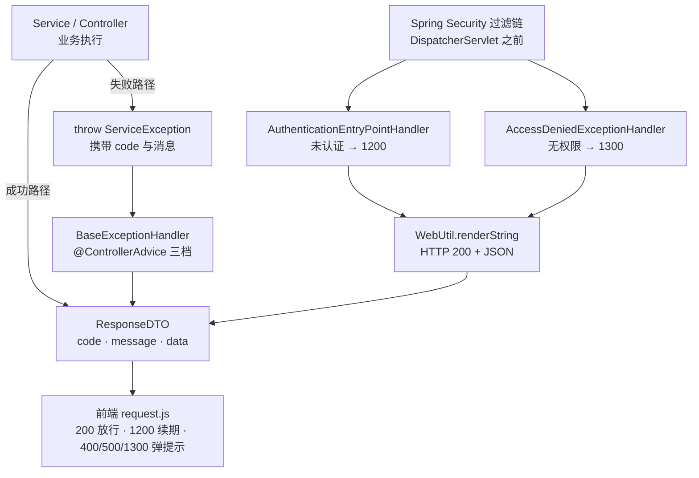

<!--
  微信公众号发布参考信息（HTML 注释，不会渲染到正文）

  【标题候选】（公众号标题上限 64 字）
  1. 从零手写数智人事系统（五）：统一响应、异常收口与枚举约定
  2. 别让每个接口自己拼 JSON：一套公共响应层与全局异常处理怎么搭
  3. @EnumValue + @JsonValue：一个枚举同时讨好 MySQL 和前端

  【摘要建议】（上限 120 字）
  上一期前端已经按 200/1200/1300 这些数字写好了拦截器，可后端还没有任何一处
  保证它们会出现。本期铺平公共地基：ResponseDTO 统一响应形状、三层异常收口
  覆盖过滤链与 Controller、BaseEnum 让枚举落库存数字、出参出中文。

  【封面建议】
  系列统一封面风格，沿用第 2/3/4 期的登录页截图：
  https://cdn.jsdelivr.net/gh/quuuuj/hrm@5f06498f73fd00480b9549d82c358494b97244fe/img/readme/01-login.png
  封面需在公众号后台单独上传，正文中的图片链接仅供编辑器抓取转存。

  【发布链路】
  用 doocs/md（https://md.doocs.org）导入本文件 —— 它支持 mermaid 渲染，
  左侧放入后右侧实时预览，再一键复制到公众号后台。mdnice 不支持 mermaid，请勿使用。

  【发布前待办】
  1. 本期无新增截图，验证输出均为 curl 文本与代码块。
  2. jsDelivr 封面 URL 已在本地 curl 验证 200（SHA=5f06498...，远端 dev）。
  3. 正文中的"实测"结论来自项目所用 Jackson 2.18.3 的本地实验，如后续升级
     Jackson 需重新验证。
-->

# 从零手写数智人事系统（五）：统一响应、异常收口与枚举约定

上一期收尾时，前端的 `hrm-admin/src/utils/request.js` 里已经躺好了三条关于错误码的规则：`1200` 触发静默续期、`400/500/1300` 统一弹提示、只有 `code === 200` 才算成功。可那时候后端一处都没写过这些数字——它们只是前端单方面的约定。

这就是公共层存在的意义：**在后端还没有业务模块之前，先把"接口长什么样"定死**。今天做三件事：所有接口用同一个形状回话，所有异常在同一个地方收口，所有枚举在落库和序列化时表现一致。

## 动手前提

需完成第 3 期：`hrm-server` 能正常启动，`http://localhost:8888/actuator/health` 返回 UP，Swagger UI 能打开。本期纯后端，不需要前端与登录态。

## 本期目标

三个公共件落地并可验证：任何接口返回的 JSON 都是 `{code, message, data}` 形状；业务异常、权限异常、未知异常各有确定且不重样的响应；枚举类型在 MySQL 里存数字、在 JSON 里出中文。用 `curl` 打三个接口就能看出区别。

## 统一响应：先把"回话的形状"定死

先给本期第一个新术语下定义：**统一响应**指后端所有接口——无论成功还是失败——都返回同一个结构的 JSON，前端只写一套判断逻辑就能处理全部接口。

很多项目在这一步就走了岔路：这个接口返回数组、那个接口返回对象、出错时直接抛 500 让 Spring 渲染一页 HTML 堆栈。前端于是被迫在每个 `.then` 里猜测"这次到底回来了什么"。

这套项目的响应体只有四个字段（`hrm-server/src/main/java/com/qiujie/common/dto/ResponseDTO.java:13`）：

```java
@Data
@AllArgsConstructor
@NoArgsConstructor
public class ResponseDTO {
    private int code;       // 状态码
    private String message; // 响应消息
    private Object data;    // 响应数据
    private String token;   // 历史遗留字段，见下文
}
```

真正给业务方用的不是这个类，而是它的静态工厂 `Response`（`hrm-server/src/main/java/com/qiujie/common/dto/Response.java:11`）。全项目 **163 处** `Response.success(...)`、**147 处** `Response.error(...)`；`new ResponseDTO(...)` 只出现在 `Response` 自己和 Security 的两个 Handler 里，业务代码一处都没有：

```java
public static ResponseDTO success()                               // 成功，无数据
public static ResponseDTO success(Object data)                    // 成功，带数据
public static ResponseDTO success(String message, Object data)     // 成功，自定义消息 + 数据
public static ResponseDTO error(String message)                    // 失败，自定义消息
public static ResponseDTO error(BaseEnum<?> e)                     // 失败，直接吃枚举
public static ResponseDTO error(Integer code, String message)      // 失败，自定义码
```

业务代码只 `import Response`，不碰 DTO 的构造细节。这一层薄薄的包装换来的是调用点好读：`return Response.error("员工姓名不能为空")` 比 `return new ResponseDTO(300, "员工姓名不能为空")` 少一次"这个 300 是哪来的"的心智负担。

顺带说一句 `token` 字段：它是历史遗留。项目早期把 Access Token 塞在响应体里交给前端存，后来改成了 **httpOnly Cookie**（第 7 期的主角），这个字段就没人读了——`LoginService` 现在传的是 `Response.success(staffDeptVO, null)`（`hrm-server/src/main/java/com/qiujie/auth/service/LoginService.java:84`）。留着是为了兼容老前端，新项目别学。

### 状态码是怎么分段的

前端那三条规则不是拍脑袋写的，`code` 的分段在 `hrm-server/src/main/java/com/qiujie/common/enums/BusinessStatusEnum.java:9` 里定死了：

| 码段 | 含义 | 典型值 |
|---|---|---|
| 200 | 成功 | `SUCCESS` |
| 300 | 通用失败 | `ERROR`（兜底） |
| 400–1100 | 具体业务失败 | `400` 员工不存在、`900` 文件上传失败、`1000` 数据导入失败 |
| 1200 | 认证失败 | `UNAUTHORIZED` |
| 1300 | 无权限 | `FORBIDDEN` |

两个细节值得注意。第一，**`ERROR` 是 300 而不是 500**：项目刻意把"HTTP 状态码"和"业务状态码"分开——HTTP 层面请求是成功送达的（200），业务层面失败了（300）。像 `if (removeById(id)) { ... } return Response.error();` 这类"删除影响行数为 0"的情形走的都是 300。

第二，`1200` 和 `1300` 是从业务码段里**单独留出来**的，因为前端拦截器要给它们开小灶（`hrm-admin/src/utils/request.js:53`）：1200 触发静默续期、1300 弹"没有权限"。这两个码一旦被业务占用，续期逻辑就会误触发。

## 异常收口：三层，两套机制

光有统一的成功响应还不够。失败路径如果各写各的 `return Response.error(...)`，业务代码里会混进大量错误处理；更糟的是，有些错误根本走不到 `return`——它们是从方法中间抛出来的。

这里引入第二个术语：**全局异常收口**指用一个集中的处理器捕获所有抛出的异常，统一翻译成响应体，业务代码只管 `throw`。

### 第一层：ServiceException，带码的业务中断

`hrm-server/src/main/java/com/qiujie/security/ServiceException.java:12` 只有二十来行，但两个构造器决定了它的好用处：

```java
public class ServiceException extends RuntimeException {
    private final int code;

    public ServiceException(int code, String message) {
        super(message);
        this.code = code;
    }

    public ServiceException(BaseEnum<?> e) {
        super(e.getMessage());
        this.code = e.getCode();
    }
}
```

第二个构造器让它可以直接吃一个枚举——`throw new ServiceException(BusinessStatusEnum.STAFF_NOT_EXIST)`，码和消息一次到位。目前项目里 5 处使用它，典型场景是"员工禁用/离职后不允许登录"（`hrm-server/src/main/java/com/qiujie/staff/service/StaffDetailsService.java:36`）。

### 第二层：@ControllerAdvice 三档兜底

`hrm-server/src/main/java/com/qiujie/security/BaseExceptionHandler.java:13` 用了 Spring MVC 的 `@ControllerAdvice`——标注它的类会成为整个应用所有 Controller 的公共"异常出口"：

```java
@ControllerAdvice
public class BaseExceptionHandler {
    @ExceptionHandler(ServiceException.class)   // 业务异常：info 日志 + 原样透出 code/message
    @ExceptionHandler(AccessDeniedException.class) // 权限异常：warn 日志 + 固定 1300
    @ExceptionHandler(Exception.class)          // 兜底：error 日志带堆栈 + "Request failed: ..."
}
```

三档的处理力度是递进的，这个递进本身就是设计：

- `ServiceException` 是**预期内**的失败，只记 `info` 一行消息，不打印堆栈，`code` 原样透出；
- `AccessDeniedException` 单独一档，是因为 `@PreAuthorize` 抛的就是它。如果不单列，它会掉进第三档被包装成 `"Request failed: Access Denied"` 这种既不像人话、又丢了 1300 语义的消息——代码注释里写的就是这个原因；
- `Exception` 是**意料外**的，记 `error` 且带堆栈，方便排查；对外只吐一句 `"Request failed: " + message`。

Spring 会按"最具体优先"自动匹配，所以你不用关心它们的书写顺序，但三档都必须在同一个类里，才能保证匹配的是同一套优先级。

### 第三层：过滤链上的两个 Handler

到这里有个容易踩空的地方：`@ControllerAdvice` 只覆盖 **DispatcherServlet 之后**的执行链路。而 Spring Security 的过滤器在这一步**之前**就跑了——Token 缺失、Token 过期、权限不足这三种情况，异常根本没机会走到 Controller，`BaseExceptionHandler` 一行都执行不到。

所以 Security 侧需要自己的出口（`hrm-server/src/main/java/com/qiujie/config/SecurityConfig.java:82`）：

```java
.exceptionHandling(eh -> eh
        .authenticationEntryPoint(authenticationEntryPointHandler)   // 未认证 → 1200
        .accessDeniedHandler(accessDeniedExceptionHandler)           // 无权限 → 1300
)
```

两个类都只做一件事：序列化一个 `ResponseDTO`，交给 `WebUtil.renderString` 写回响应（`hrm-server/src/main/java/com/qiujie/util/WebUtil.java:14`）。

**关键在 `WebUtil` 里那行 `response.setStatus(200)`**。它刻意把 HTTP 状态码维持在 200，而不是 401/403，把"成功与否"完全交给响应体里的 `code`。这正是前端拦截器能工作的前提——如果这里返回 401，axios 会走 `error` 分支，`request.js` 里那段"读 `res.code === 1200` 然后静默续期"的逻辑就永远进不去。

整条链路连起来是这样：



## BaseEnum：一个接口，双注解约定

第三个术语：**BaseEnum** 是项目所有业务枚举实现的公共接口，统一了"每个枚举都有一对 `code`（落库值）和 `message`（展示值）"这个约定（`hrm-server/src/main/java/com/qiujie/common/enums/BaseEnum.java:13`）：

```java
public interface BaseEnum<T> extends Serializable {
    Integer getCode();
    String getMessage();
}
```

（顺带一提：泛型 `T` 在这份定义里其实没被用到，`getCode()` 直接写死了 `Integer`。这是历史包袱，但不影响使用——所有实现都写 `implements BaseEnum<Integer>`。）

目前有 8 个枚举实现它，覆盖性别、请假类型、审核状态、考勤状态、加班类型、扣款类型和业务状态。看最简洁的一个，`hrm-server/src/main/java/com/qiujie/staff/enums/GenderEnum.java:11`：

```java
@Getter
@AllArgsConstructor
public enum GenderEnum implements BaseEnum<Integer> {

    MALE(0, "男"),
    FEMALE(1, "女");

    @EnumValue
    private final Integer code;
    @JsonValue
    private final String message;
}
```

两个注解各管一条链路，这是本期最值得记住的一处设计：

- **`@EnumValue` 管数据库**：MyBatis-Plus 写库时取 `code`，所以 `sys_staff.gender` 列里躺的是 `0/1` 这种数字，不是枚举名也不是中文。这些注解之所以能被自动识别，靠的是第 3 期在 `application.yml:73` 埋的 `type-enums-package: com.qiujie.*.enums`——伏笔在这里回收。
- **`@JsonValue` 管 JSON**：Jackson 序列化时取 `message`，所以接口返回的 `gender` 是 `"男"` 而不是 `"MALE"`。前端 `<el-table-column prop="gender">` 直接就能显示。

### 实测：反序列化会发生什么

序列化好理解，反序列化（前端提交 → 后端接住）才是坑最多的地方。我用项目实际使用的 Jackson 2.18.3 写了个最小实验，把 `GenderEnum` 的几种入参各试了一遍：

| 入参 | 结果 |
|---|---|
| `"男"` / `"女"` | 正常映射到 MALE / FEMALE |
| `"0"` / `"1"` | 能过，但走的是**序号**而非业务 code |
| `"FEMALE"`（枚举名） | **失败**，抛 InvalidFormatException |
| `2`（越界的数字） | **失败** |

两条结论：**第一，前端提交枚举字段时必须提交中文 message**——这解释了为什么员工表单的性别下拉框写的是 `<el-option value="男"/>`（`hrm-admin/src/views/system/staff/index.vue:45`），而不是 `value="MALE"`。**第二，数字入参是按序号（下标）解析的，不是按 code**：这在 `code` 恰好等于序号的枚举（如 `GenderEnum` 的 0/1）上看起来正常，一旦枚举的 `code` 与顺序不一致就会静默错位。项目所有枚举字段的入口都靠前端传中文，所以没踩到这个雷，但你自己写枚举时务必注意。

### EnumUtil：把枚举喂给前端做下拉框

枚举光在后端自己用还不够，前端还要拿它渲染下拉框。`hrm-server/src/main/java/com/qiujie/util/EnumUtil.java:61` 提供了 `getEnumList`，把任意 `BaseEnum` 实现转成 `[{code, message}, ...]`：

```java
public static <T extends BaseEnum<?>> List<Map<String, Object>> getEnumList(Class<T> enumType)
```

用法极简，比如请假类型字典（`hrm-server/src/main/java/com/qiujie/leave/service/LeaveService.java:99`）：

```java
public ResponseDTO queryAll() {
    return Response.success(EnumUtil.getEnumList(LeaveEnum.class));
}
```

前端一个 `queryAll()` 拿到 `[{code:0,message:"事假"}, ...]`，直接喂给 `el-select`。新增一种请假类型时，后端加一个枚举常量，前端下拉框自动多一项，零改动。

有些枚举还多带一个字段，比如 `AuditStatusEnum` 的 `tagType`（`hrm-server/src/main/java/com/qiujie/leave/enums/AuditStatusEnum.java:30`）。它存的是 Element UI 的颜色名——`"success"`、`"danger"`、`"info"`，前端 `<el-tag :type="tagType">` 直接吃。业务状态和视觉表现因此也统一收敛进了枚举，不用在前端写 `if (status === '审核通过')` 这种脆弱的字符串判断。

## 动手验证：三个 curl 看形状

后端启动后（`mvn spring-boot:run`），依次打三条，对比响应形状。

### 1. 成功响应

```bash
curl -s http://localhost:8888/leave/all
# 预期: {"code":200,"message":"成功","data":[{"code":0,"message":"事假"}, ...],"token":null}
```

这一条同时验证了三件事：统一响应形状、`EnumUtil` 字典接口、枚举的 `code/message` 拆解。

### 2. 未认证响应（走过滤链）

```bash
curl -s -w "\nHTTP %{http_code}\n" http://localhost:8888/staff/1
# 预期: {"code":1200,"message":"认证失败，请重新登录","data":null,"token":null}
#       HTTP 200
```

注意那个 **HTTP 200**——不是 401。这正是上面说过的设计：认证结果放在 `code` 里，HTTP 层保持 200，前端才好在同一个分支里处理"续期"。

### 3. 未知异常响应（走 @ControllerAdvice 兜底）

把某个接口临时改成 `throw new RuntimeException("test")`（验证完记得改回来），再请求它：

```bash
# 预期: {"code":300,"message":"Request failed: test","data":null}，HTTP 200
```

如果看到的是 Spring 默认的错误页或 HTML 堆栈，说明 `@ControllerAdvice` 没生效——先检查 `BaseExceptionHandler` 是不是在所扫描的包路径下。

## 小坑提醒

- **`@ControllerAdvice` 抓不到过滤链异常**：Token 无效这类错误根本走不到 Controller，必须靠 `authenticationEntryPoint` / `accessDeniedHandler` 兜。加了 `@ControllerAdvice` 却发现 401 还是原始响应，多半是这个原因。
- **两个"状态码"别混**：`response.setStatus(200)` 是 HTTP 状态码，响应体里的 `code` 是业务状态码。项目刻意让它们解耦，改 `WebUtil` 时别顺手把它改成 401。
- **枚举字段的入参格式**：前端提交枚举时必须给中文 message（`"男"`），给枚举名 `"MALE"` 会直接反序列化失败；数字入参按序号解析而非 code，`code` 与顺序不一致的枚举上会错位。
- **`AccessDeniedException` 需要单独一档**：少了它，`@PreAuthorize` 拦截会被兜底处理器包装成 `"Request failed: Access Denied"`，前端拿到的不再是 1300，权限提示逻辑就失效了。
- **日志级别不是随手写的**：`ServiceException` 用 `info`（预期内，不刷堆栈）、未知异常用 `error`（带堆栈）。线上排障时，这两档的区别决定了日志里有没有噪音。

## 小结

到这一步，后端有了统一的地基：

1. **`ResponseDTO` + `Response`** 定死了回话形状，全项目 310 处返回点共用一套工厂方法，前端拦截器的三条规则从此有了后端保证；
2. **异常收口分两套机制三层**——`ServiceException` 走 `@ControllerAdvice` 三档，过滤链上的认证/授权异常走 Security 的两个 Handler，最后统一由 `WebUtil` 以 HTTP 200 + 业务码写回；
3. **`BaseEnum` + `@EnumValue` + `@JsonValue`** 让每个枚举同时讨好 MySQL（存数字）和前端（出中文），`EnumUtil` 把枚举直接变成下拉框数据源。

公共层铺平了，下一期该低头看地基下面那层了——三套数据库、84 张表，`sys_`/`per_`/`att_`/`sal_`/`soc_`/`kb_`/`file_`/`chat_` 这些前缀各自代表什么、为什么明明没有物理外键却要拆成三库、PG 侧的 `vector(1024)` 又是怎么回事。表结构设计理清了，后面写业务模块才不会返工。

**GitHub**：https://github.com/quuuuj/hrm

如果这个项目对你有帮助，欢迎 Star。
