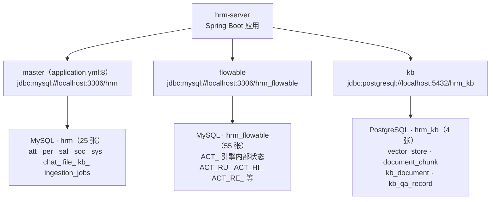
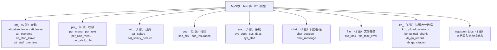

<!--
  微信公众号发布参考信息（HTML 注释，不会渲染到正文）

  【标题候选】（公众号标题上限 64 字）
  1. 从零手写数智人事系统（六）：84 张表怎么分——三库分工与命名前缀实战
  2. 不用 Flyway、不加外键：这套人事系统的表结构设计为何敢这么"野"
  3. MySQL 25 + Flowable 55 + PG 4：三库表结构一次讲透

  【摘要建议】（上限 120 字）
  公共层铺好了，低头看地基下面那层：三库 84 张表怎么分、为什么这么分。
  本期拆解表名前缀的八组业务模块、零物理外键的逻辑约束策略、联合唯一索引
  防重复打卡，以及 PG 侧 vector(1024)+HNSW 的向量存储——schema 即设计文档。

  【封面建议】
  系列统一封面风格，沿用第 2/3/4/5 期的登录页截图：
  https://cdn.jsdelivr.net/gh/quuuuj/hrm@5f06498f73fd00480b9549d82c358494b97244fe/img/readme/01-login.png
  封面需在公众号后台单独上传，正文中的图片链接仅供编辑器抓取转存。

  【发布链路】
  用 doocs/md（https://md.doocs.org）导入本文件 —— 它支持 mermaid 渲染，
  左侧放入后右侧实时预览，再一键复制到公众号后台。mdnice 不支持 mermaid，请勿使用。

  【发布前待办】
  1. 本期无新增截图，验证输出均为 SQL 文本与代码块。
  2. jsDelivr 封面 URL 已在本地 curl 验证 200（SHA=5f06498...，远端 dev）。
  3. 两幅 mermaid 图（三库分工 + 表分组树）需在 doocs/md 实测渲染。
-->

# 从零手写数智人事系统（六）：84 张表怎么分——三库分工与命名前缀实战

上一期把公共层铺平了，今天低头看更底下那层——数据库。这套系统有 **84 张表**，分散在三套数据库里：MySQL `hrm` 25 张、MySQL `hrm_flowable` 55 张、PostgreSQL `hrm_kb` 4 张。

第一次打开 `hrm.sql` 的人通常会愣两秒：没有外键、没有 Flyway 迁移记录、表名全带前缀。这套 schema 不是在"遵守规范"，而是在回答三个具体问题：**表放哪个库？约束谁来管？结构变更怎么进仓库？**今天把这三个问题的答案一次讲透。

## 动手前提

需完成第 2 期：三套数据库已通过 `docker compose` 起好，`db/` 目录下三个 SQL 文件已导入。本期不需要后端启动，用 `docker exec` 进库看结构即可。

## 本期目标

读懂 `db/mysql/hrm.sql` 的 25 张表分成了哪八组、为什么没有物理外键、唯二的联合唯一索引在防什么；看清 PG 侧 `vector(1024)` + HNSW 索引的用途；理解"直接改全量 SQL"这个迁移策略的取舍依据。

## 三库分工：不是数据量大，是生命周期不同

先给本期第一个术语下定义：**三库分工**指按数据的生命周期和存储能力，把表分散到三个数据库实例，每个库只装一类东西。

很多项目的多库拆分是为了读写分离或分库分表——这套系统都不是。三个库的划分标准是：**谁产生数据、谁消费数据、数据被谁管理**。



**为什么 Flowable 要单独一库？** 不是性能问题，是**所有权**问题。`ACT_RU_*`（运行时）、`ACT_HI_*`（历史）、`ACT_RE_*`（定义）这 55 张表是 Flowable 引擎自己建的、自己写的、自己清的。它们和业务单据（请假单、加班单）是两个生命周期：业务表有 `is_deleted` 逻辑删除、要关联 `sys_staff`；引擎表是框架内部状态，你既不该改它，也不该在备份策略上和业务表混为一谈。把它们放同一个库，某次 `TRUNCATE` 或 `DROP` 手滑，流程引擎直接瘫痪。分开之后，`DataSourceConfig` 里用一个 `EngineConfigurationConfigurer` 把 Flowable 的连接池指到 `flowable` 库（`hrm-server/src/main/java/com/qiujie/config/DataSourceConfig.java:59`），业务代码的 `@Transactional` 永远碰不到那 55 张表。

**为什么知识库必须是 PostgreSQL？** 因为向量检索需要 pgvector 扩展，MySQL 没有这个能力（MySQL 8.4 才引入向量类型，生态远不如 pgvector 成熟）。而 `hrm_kb` 库里的 4 张表只服务一件事：**存向量、查向量**。`vector_store` 存 embedding，`document_chunk` 存切块元数据，`kb_document` 是 MySQL 侧 `sys_docs` 在 PG 的镜像投影（第 22 期讲镜像同步时会展开），`kb_qa_record` 记录问答日志。业务主数据一张都不放进来。

**为什么业务库是 MySQL 而不是 PostgreSQL？** 纯粹的生态惯性。项目从 2022 年开始演进，当时选 MySQL 是因为团队熟悉、运维工具多、生态成熟。pgvector 的出现给了 PG 一个不可替代的理由，但不足以推翻整个业务库的选型——两个 MySQL 一个 PG 的"2+1"格局就是这么来的，不是最优解，是演进出来的合理解。

## 表名前缀：八组前缀就是八个业务模块

打开 `db/mysql/hrm.sql`，25 张表的名字不是随便起的，前缀直接对应业务模块：



这个前缀分组不是装饰，它干了三件事：

**第一，物理隔离变逻辑分组。** 同一前缀的表在同一个业务边界内，`att_*` 只被考勤模块读写，`per_*` 只被权限模块读写。看到 `att_leave` 就知道它归请假管，看到 `per_role_menu` 就知道它归 RBAC 管——不用翻代码，表名自己说话。

**第二，分组即验收清单。** 当你新增一个业务模块时，第一批问题就是"要不要新前缀？"比如第 20 期讲分片上传时，`kb_upload_session` 和 `kb_upload_chunk` 虽然管的是文件二进制元数据，但因为归属"知识库文档摄入"这个业务域，所以用 `kb_` 前缀而不是 `file_`——`file_` 那两张表是给通用异步任务引擎用的（第 21 期展开）。前缀帮你把"这个表归谁管"变成一次显式决策，而不是默认扔进 `sys_` 大杂烩。

**第三，`ingestion_jobs` 是个例外，例外本身有意义。** 它是唯一不带前缀的表，因为它不属于任何单一业务模块——它是跨模块的流水线状态表，文件摄入（知识库）和批量导入（员工/薪资）都会往里面写。不带前缀就是在声明"我不归某个域管"。

## 零物理外键：约束在索引里，不在 FK 里

`hrm.sql` 里最显眼的特点是：**一张 `FOREIGN KEY` 都没有**（除了 Flowable 自己的 `ACT_*` 表内部约束）。`sys_staff` 有 `dept_id` 关联 `sys_dept`，`per_staff_role` 有 `staff_id` 和 `role_id`，但统统是普通列，没有 `FOREIGN KEY (dept_id) REFERENCES sys_dept(id)` 这种声明。

这里引入第二个术语：**逻辑外键**指在代码层（Service/Mapper）通过 `JOIN` 查询或 `QueryWrapper` 条件保证数据关联性，而不是依赖数据库外键约束。

为什么不用物理外键？三个现实原因：

1. **逻辑删除让外键失效。** 项目所有表都有 `is_deleted` 字段（第 11 期讲），删除是 `UPDATE is_deleted=1` 不是 `DELETE`。物理外键的 `ON DELETE CASCADE/SET NULL` 在这种情况下完全帮不上忙——员工"删除"后，他的考勤记录、请假单、薪资单都还在，`is_deleted` 是唯一真相。
2. **导入导出场景外键是负担。** 第 20 期会讲到批量导入员工数据，如果 `sys_staff` 对 `sys_dept` 有外键，导入顺序必须是先部门后员工，失败回滚也麻烦。逻辑外键下，导入脚本可以先插员工再补部门校验，灵活得多。
3. **Flyway/Liquibase 缺失的连锁反应。** 没有迁移工具（下面会讲），意味着表结构变更靠改全量 SQL。物理外键会让"改表"变成"先删约束再改再加约束"的多步操作，全量 SQL 的可读性和幂等性都变差。

那谁来保证 `staff_id` 不会指向一个不存在的员工？答案是**应用层**。`StaffService` 删除员工时会先检查他有没有未审批的请假单（`hrm-server/src/main/java/com/qiujie/staff/service/StaffService.java:189`），`LeaveService` 创建请假单时会校验 `staff_id` 必须在 `sys_staff` 里存在且 `is_deleted=0`。这些校验写在 Service 层，用 `QueryWrapper.eq("staff_id", staffId).eq("is_deleted", 0).exists()` 这类查询兜底。

代价当然有：你得信任所有 Service 都做了校验。但换来的是灵活性——跨库关联（比如 `att_leave` 里的 `process_instance_id` 指向 `hrm_flowable` 库的 `ACT_RU_EXECUTION`）本来就没法用物理外键，逻辑外键让跨库和单库的约束策略统一了。

## 联合唯一索引：唯二的 UNIQUE KEY 在防什么

没有外键不代表没有约束。`hrm.sql` 里只有两个 `UNIQUE KEY`，每一个都对应一个"绝不能重复"的业务规则：

**第一个：`uk_attendance_staff_date`（`db/mysql/hrm.sql:38`）**

```sql
CREATE TABLE `att_attendance`  (
  `id` int UNSIGNED NOT NULL AUTO_INCREMENT,
  `staff_id` int UNSIGNED NOT NULL COMMENT '员工id',
  `attendance_date` date NOT NULL COMMENT '考勤日期',
  ...
  UNIQUE KEY `uk_attendance_staff_date` (`staff_id`, `attendance_date`)
) COMMENT = '考勤表';
```

**一个员工一天只能有一条考勤记录。** 这是打卡系统的铁律：早上 9 点打卡、晚上 6 点打卡，都必须写进同一行（`check_in_time` 和 `check_out_time` 两列）。如果放开成两条记录，"今天出勤多久"就要 `GROUP BY` 求和，统计逻辑全乱。这个联合唯一索引让"重复打卡"在数据库层直接报错 `Duplicate entry`，Service 层捕获后提示"今日已打卡"，不可能出现脏数据。

**第二个：`uk_session_chunk`（`db/mysql/hrm.sql:1367`）**

```sql
CREATE TABLE `kb_upload_chunk` (
  `id` bigint NOT NULL AUTO_INCREMENT,
  `upload_id` varchar(64) NOT NULL COMMENT '上传会话ID',
  `chunk_index` int NOT NULL COMMENT '分片序号',
  ...
  UNIQUE KEY `uk_session_chunk` (`upload_id`, `chunk_index`)
) COMMENT = '分片上传块表';
```

**一个上传会话里同一个分片序号只能上传一次。** 第 20 期分片上传会细讲：前端把大文件切成 10MB 一块逐个上传，网络重试时同一个分片可能发两次。这个唯一索引保证第二次写入直接失败，后端返回"分片已存在"，前端跳过即可——不用在应用层写 `SELECT ... FOR UPDATE` 的防重逻辑。

为什么其他表不加唯一索引？因为**唯一性约束必须是"违背即数据错误"的规则**。员工姓名可以重复、角色名可以重复（`per_role` 的 `role_name` 没加唯一索引，因为不同角色可以有同名不同权限的副本）、请假单号可以重复（`att_staff_leave` 的 `leave_no` 只是展示用，不保证唯一）。真正需要数据库兜底的只有这两种"物理上不可能重复"的场景。

## PG 侧：vector(1024) + HNSW 的最小可用集

`db/postgresql/knowledge_base.sql` 只有 80 行，但每一行都是设计决策：

```sql
CREATE EXTENSION IF NOT EXISTS vector;                          -- 行 7

CREATE TABLE IF NOT EXISTS vector_store (
    id        uuid DEFAULT gen_random_uuid() PRIMARY KEY,
    content   text,
    metadata  jsonb,
    embedding vector(1024) NOT NULL                              -- 行 15
);
CREATE INDEX IF NOT EXISTS vector_store_embedding_idx
    ON vector_store USING hnsw (embedding vector_cosine_ops);   -- 行 17-18
```

**`vector(1024)` 对应 text-embedding-v3**——项目用的通义千问 embedding 模型输出固定 1024 维向量，列类型必须精确匹配，第 23 期摄入流水线往这里写向量时维度不符会直接报错。

**HNSW（Hierarchical Navigable Small World）**是 pgvector 提供的近似最近邻索引，比暴力扫描快几个数量级。`vector_cosine_ops` 指定用余弦相似度——文本向量通常不归一化，余弦距离比欧氏距离更合理。这两行的组合让 `SELECT * FROM vector_store ORDER BY embedding <=> '[0.1, 0.2, ...]' LIMIT 5` 这种向量检索能在毫秒级返回。

`document_chunk` 表（行 21-34）存的是**切块的元数据**——哪份文档、第几块、起止字符位置、token 数。它也有个 `UNIQUE (document_id, chunk_index)`（行 32），和 MySQL 侧 `uk_session_chunk` 一个思路：同一个文档的第 3 块只能存在一次。`char_start`/`char_end` 这两列看起来冗余（`chunk_text` 里就有原文），但它们让"邻窗扩展"成为可能——第 24 期混合检索时，召回第 5 块后可以顺手把第 4、6 块也拉出来给 LLM 当上下文，不用再做字符串拼接。

## 种子数据：导入完成就能登录

`hrm.sql` 每张表后面都跟着 `INSERT INTO` 语句——这不是测试数据，是**种子数据**（本期第三个术语）：**让系统从零启动时必须具备的最小数据集**。

看几个关键的：

- `sys_staff`：38 行，包含默认管理员 `admin`（密码 bcrypt 哈希对应 `123456`）、各部门示例员工。
- `sys_dept`：20 行，预设的部门树（总经办、技术部、人事部等）。
- `per_menu`：90 行，所有菜单和权限点——"员工管理"、"请假审批"、"数据导入"按钮的权限标识全在这里。
- `per_role` + `per_role_menu` + `per_staff_role`：预设了"超级管理员"、"人事专员"等角色，以及它们能看到哪些菜单、哪个员工绑定了哪个角色。

**为什么种子数据要入库而不是代码生成？** 因为它们是"结构的一部分"。`per_menu` 表里的 `permission` 列值（如 `system:staff:add`）和后端 `@PreAuthorize("hasAuthority('system:staff:add')")` 是硬编码关联的，菜单 ID 还决定了前端路由的 `parent_id` 和层级。把这些写成代码里的常量，等于把数据当成了代码；写成 SQL，数据就是数据，改菜单不动代码。

**为什么不用 Flyway/Liquibase？** 答案在 `hrm.sql` 的结构里：每张表都是 `DROP TABLE IF EXISTS` + `CREATE TABLE` + `INSERT INTO` 三段式，**全量重跑永远得到最终结构**。这个项目从 2022 年演进到现在，表结构变更直接改这三段式，改完重导就行。引入 Flyway 意味着要写 `V001__init.sql`、`V002__add_column.sql` 这种增量迁移，而增量脚本在项目规范里是禁止入库的（见根目录 `.gitignore` 和项目记忆）——**与其维护一套会被 gitignore 的迁移系统，不如让全量 SQL 本身就是唯一真相**。

代价很明显：生产环境升级时不能直接重跑 `DROP TABLE`。但这个系统的定位是"从零手写"的教学项目，部署时初始化一次即可，不需要在线 schema 演进——第 28 期部署时会再强调这一点。

## 动手验证：三条 SQL 看结构

```bash
# 1. 看三库的表数量（应为 25 / 55 / 4）
docker exec hrm-mysql mysql -uroot -p123456 -N -e \
  "SELECT table_schema, COUNT(*) FROM information_schema.tables
   WHERE table_schema IN ('hrm','hrm_flowable') GROUP BY table_schema;"
docker exec hrm-postgres psql -U hrm -d hrm_kb -c "\dt"

# 2. 看前缀分组（应输出 att_/per_/sal_/soc_/sys_/chat_/file_/kb_ 八组）
docker exec hrm-mysql mysql -uroot -p123456 -N -e \
  "SELECT SUBSTRING_INDEX(table_name, '_', 1) AS prefix, COUNT(*)
   FROM information_schema.tables WHERE table_schema='hrm'
   GROUP BY prefix ORDER BY COUNT(*) DESC;"

# 3. 看唯一索引（应只看到 uk_attendance_staff_date 和 uk_session_chunk）
docker exec hrm-mysql mysql -uroot -p123456 -N -e \
  "SELECT table_name, index_name FROM information_schema.statistics
   WHERE table_schema='hrm' AND non_unique=0 AND index_name != 'PRIMARY';"
```

第三条如果输出了其他索引，说明你手上的 `hrm.sql` 被改过——对照 Git 历史确认一下。

## 小坑提醒

- **改表结构必须改全量 SQL**：新增列直接改 `CREATE TABLE` 段，新增数据改 `INSERT INTO` 段，别写 `ALTER TABLE` 脚本——入库的只有全量文件，增量迁移会被 gitignore 拦截。
- **`is_deleted` 是逻辑删除的唯一标志**：所有表的删除都是 `UPDATE is_deleted=1`，物理外键的级联删除在这里完全失效，关联数据的清理必须在 Service 层显式做。
- **`ingestion_jobs` 不带前缀是刻意的**：它是跨模块的流水线状态表，不归任何单一业务域管。看到它别以为是命名疏漏。
- **PG 侧 `kb_document` 是镜像不是主表**：MySQL 的 `sys_docs` 才是文档生命周期的真相源，PG 这张表只供本地 JOIN 用（第 22 期展开），别往里面写数据。

## 小结

到这一步，84 张表的分工逻辑应该清楚了：

1. **三库分工按生命周期切**：业务主数据（MySQL `hrm`）、引擎内部状态（MySQL `hrm_flowable`）、向量存储（PG `hrm_kb`）各管各的，`DataSourceConfig` 里三个连接池一一对应。
2. **表名前缀是模块边界**：`att_`/`per_`/`sal_`/`soc_`/`sys_`/`chat_`/`file_`/`kb_` 八组前缀把 25 张表切成八个业务域，`ingestion_jobs` 用无前缀声明跨模块属性。
3. **约束策略是"索引 + 逻辑外键"**：零物理外键换来逻辑删除和跨库关联的灵活性，唯二的联合唯一索引（`uk_attendance_staff_date`、`uk_session_chunk`）只在"物理上不可能重复"的场景兜底。
4. **Schema 即最终文档**：没有 Flyway，`hrm.sql` 的三段式（DROP + CREATE + INSERT）本身就是完整真相，种子数据直接入库保证"导入即可登录"。

表结构理清了，下一期该往上走一层了——登录。两套 Token 怎么配合、`httpOnly Cookie` 为什么比 `localStorage` 更安全、`JwtAuthenticationFilter` 三层降级取 token 的逻辑又是怎么回事。认证这层搞懂了，后面的权限、业务模块才有地基。

**GitHub**：https://github.com/quuuuj/hrm

如果这个项目对你有帮助，欢迎 Star。
